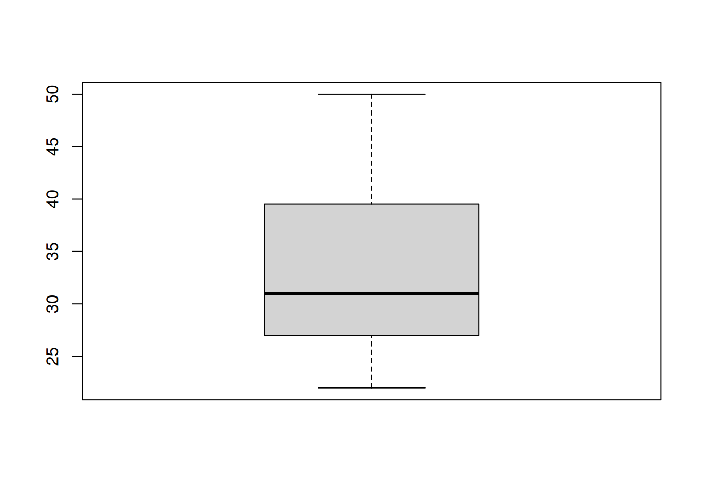
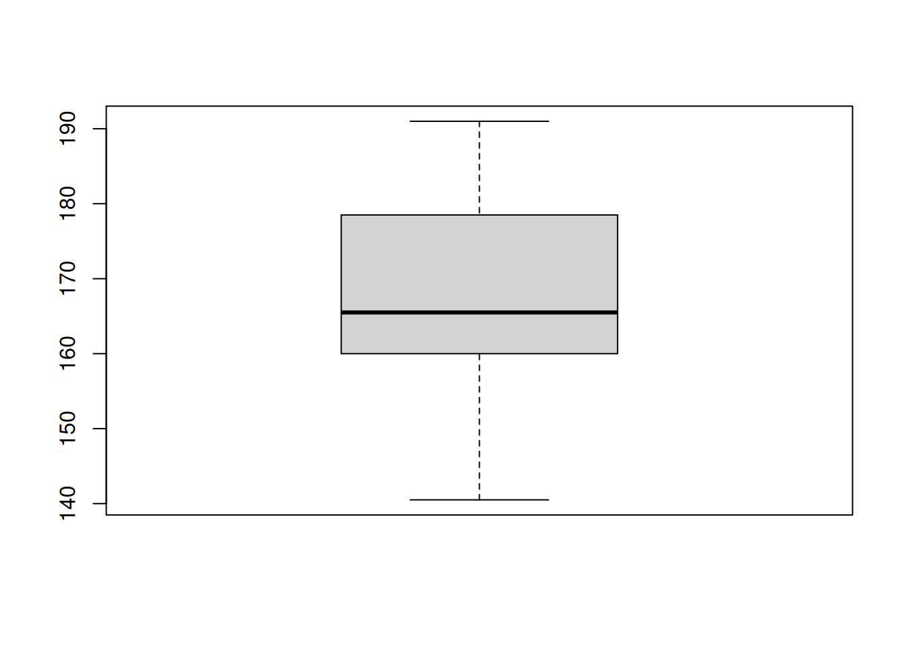
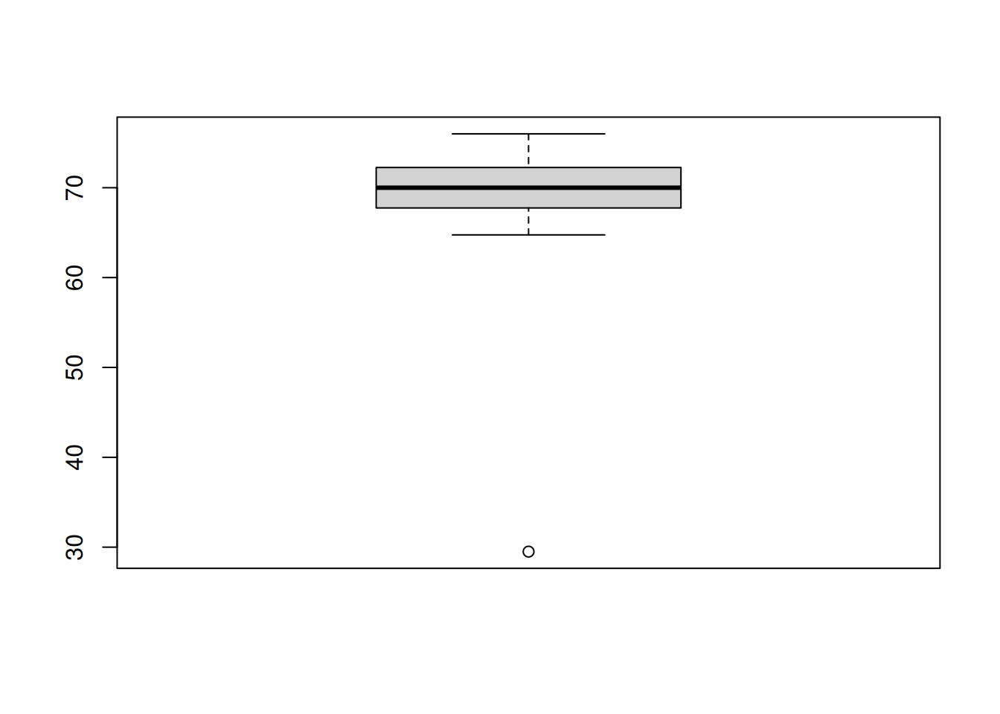
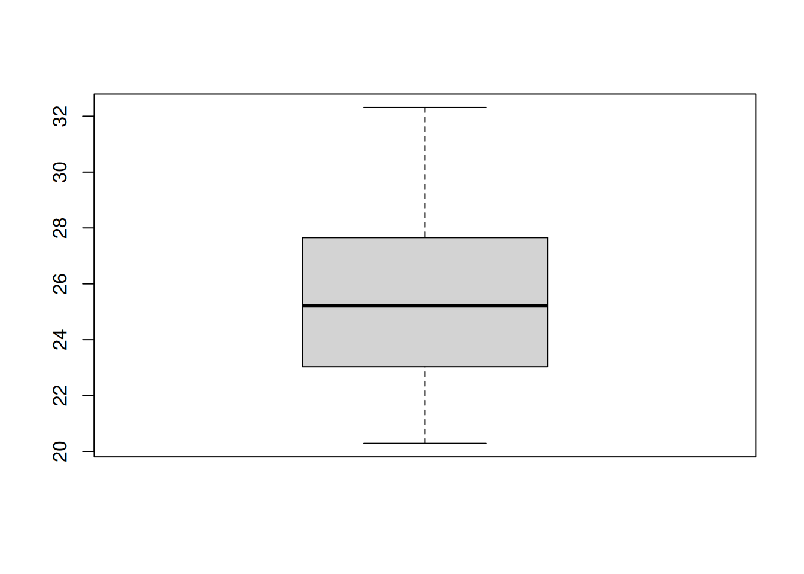
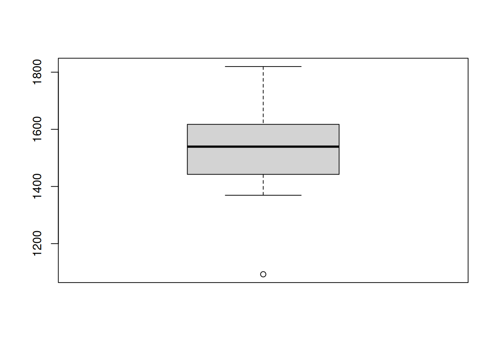
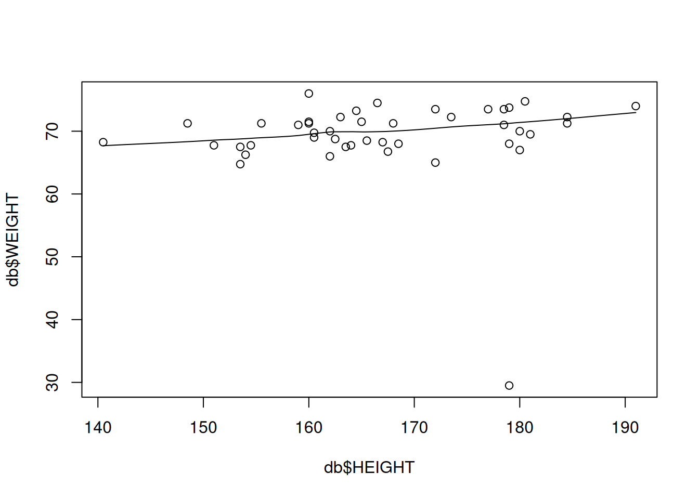
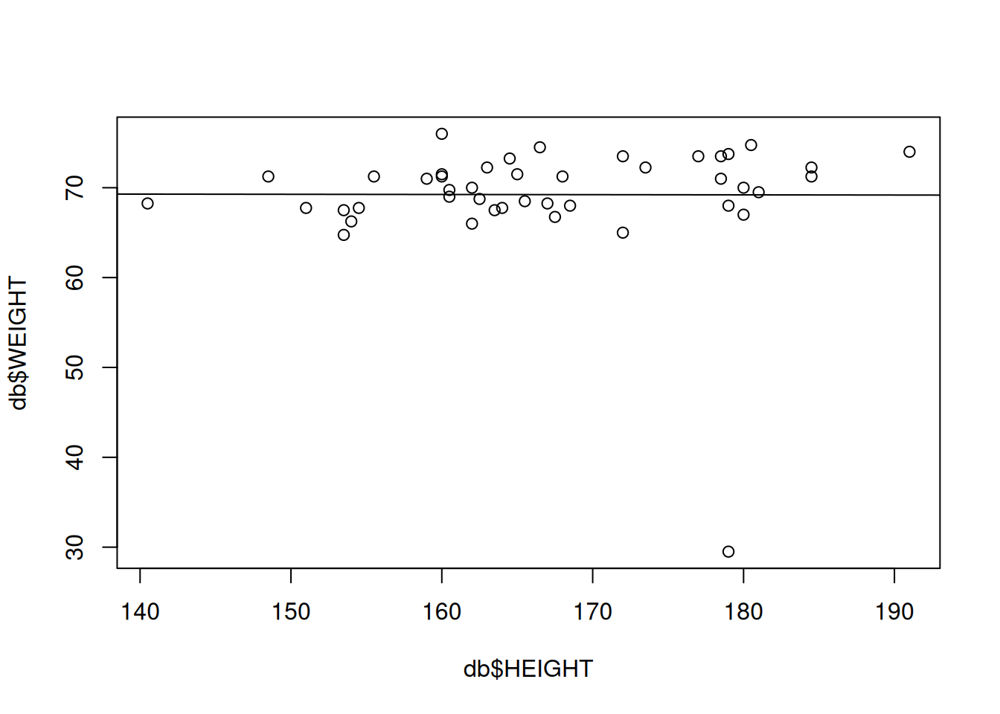

# Handling Missing Values & Linear Regression 
#### Bhuvan Kapoor 


``` r
data  <- read.csv("/home/bhuvan-kapoor/Codes/R/MAT6002 | Regression Analysis/Health_data.csv")
data
```

    ##    IDNO AGE GENDER Exercise HEIGHT WEIGHT      BMI      BMR MARITAL.STATUS
    ## 1     1  23      M        Y  154.5  67.75 28.38261 1606.883            YES
    ## 2     2  22      F        Y  173.5  72.25 24.00153 1557.932             NO
    ## 3     3  22      F        N  154.0  66.25 27.93473 1442.039            YES
    ## 4     4  26      F        N  184.5  72.25 21.22487 1574.690             NO
    ## 5     5  24      F        Y  184.5  71.25 20.93110       NA            YES
    ## 6     6  24      M        Y  180.5  74.75 22.94335 1819.759            YES
    ## 7     7  26      M        Y  181.0     NA 21.29056 1743.820             NO
    ## 8     8  25      M        N     NA  72.50 23.40522       NA             NO
    ## 9     9  NA      F        N  191.0  74.00 20.28453 1615.339             NO
    ## 10   10  23      M        Y  178.5  73.50       NA 1799.092            YES
    ## 11   11  26      F        N  166.5  74.50 26.87372 1539.732            YES
    ## 12   12  27      F        Y  160.0  76.00 29.68750 1529.135            YES
    ## 13   13  32      M        N     NA  69.50 21.33194 1704.009             NO
    ## 14   14  30      F        N  155.5  71.25 29.46620       NA            YES
    ## 15   15  35      M        Y  181.0  69.50       NA 1689.378             NO
    ## 16   16  NA      F        Y  162.0  66.00 25.14861 1408.221            YES
    ## 17   17  34      M        N  175.5     NA 23.05176       NA            YES
    ## 18   18  32      F        N  159.0  71.00 28.08433 1458.152             NO
    ## 19   19  28      F        N  164.0  67.75 25.18962       NA            YES
    ## 20   20  33      M        Y  172.0  73.50 24.84451 1711.129             NO
    ## 21   21  28      M        N  179.0  68.00 21.22281 1699.423            YES
    ## 22   22  NA      F        Y  160.5  69.75 27.07660 1468.560             NO
    ## 23   23  31      F        N  140.5  68.25       NA 1379.740            YES
    ## 24   24  32      M        Y  148.5     NA 31.74279 1557.139            YES
    ## 25   25  28      F        Y  151.0  67.75 29.71361       NA             NO
    ## 26   26  27      M        Y  160.0  71.50 27.92969 1660.809            YES
    ## 27   27  34      M        N  163.5  67.50 25.25040 1584.278             NO
    ## 28   28  31      F        N     NA  67.50       NA 1427.020            YES
    ## 29   29  27      M        Y  153.5  64.75 27.48040 1539.185            YES
    ## 30   30  29      F        Y  160.5  69.00 26.78545 1457.295             NO
    ## 31   31  32      F        N  179.0  73.75 23.01738 1545.541            YES
    ## 32   32  29      M        N  160.0  71.25 27.83203       NA             NO
    ## 33   33  27      F        Y  168.0  71.25 25.24447 1509.996            YES
    ## 34   34  41      M        Y  178.5  71.00       NA 1663.414             NO
    ## 35   35  41      M        Y  177.0  73.50 23.46069 1689.707            YES
    ## 36   36  NA      F        N  172.0  65.00 21.97134 1369.334            YES
    ## 37   37  40      F        N  162.0  70.00 26.67276 1423.559             NO
    ## 38   38  50      M        Y  167.0  68.25 24.47201 1520.290            YES
    ## 39   39  46      F        Y  163.0  72.25 27.19335 1421.483             NO
    ## 40   40  NA      M        Y  180.0  67.00 20.67901 1565.931            YES
    ## 41   41  NA      F        Y  162.5  68.75 26.03550 1391.899            YES
    ## 42   42  44      M        N  179.0  29.50       NA 1092.806             NO
    ## 43   43  48      M        N  180.0  70.00 21.60494 1617.476            YES
    ## 44   44  41      F        N  165.0  71.50 26.26263 1442.393             NO
    ## 45   45  39      M        Y  168.5  68.00 23.95020       NA            YES
    ## 46   46  43      F        N  164.5  73.25 27.06923 1448.367             NO
    ## 47   47  NA      F        N  153.5  67.50 28.64752 1374.109            YES
    ## 48   48  39      M        Y  148.5  71.25 32.30963 1534.147            YES
    ## 49   49  45      M        N  165.5  68.50 25.00890 1544.826             NO
    ## 50   50  47      M        N  167.5  66.75 23.79149 1519.625            YES

``` r
total_col  <- ncol(data)
total_col
```

    ## [1] 9

``` r
total_row  <- nrow(data) 
total_row
```

    ## [1] 50

``` r
summary_  <- summary(data)
summary_
```

    ##       IDNO            AGE           GENDER            Exercise        
    ##  Min.   : 1.00   Min.   :22.00   Length:50          Length:50         
    ##  1st Qu.:13.25   1st Qu.:27.00   Class :character   Class :character  
    ##  Median :25.50   Median :31.00   Mode  :character   Mode  :character  
    ##  Mean   :25.50   Mean   :32.81                                        
    ##  3rd Qu.:37.75   3rd Qu.:39.50                                        
    ##  Max.   :50.00   Max.   :50.00                                        
    ##                  NA's   :7                                            
    ##      HEIGHT          WEIGHT           BMI             BMR      
    ##  Min.   :140.5   Min.   :29.50   Min.   :20.28   Min.   :1093  
    ##  1st Qu.:160.0   1st Qu.:67.75   1st Qu.:23.04   1st Qu.:1444  
    ##  Median :165.5   Median :70.00   Median :25.22   Median :1539  
    ##  Mean   :167.1   Mean   :69.27   Mean   :25.38   Mean   :1539  
    ##  3rd Qu.:178.5   3rd Qu.:72.25   3rd Qu.:27.57   3rd Qu.:1617  
    ##  Max.   :191.0   Max.   :76.00   Max.   :32.31   Max.   :1820  
    ##  NA's   :3       NA's   :3       NA's   :6       NA's   :8     
    ##  MARITAL.STATUS    
    ##  Length:50         
    ##  Class :character  
    ##  Mode  :character  
    ##                    
    ##                    
    ##                    
    ## 

``` r
# install.packages("tidyverse")
library(tidyverse)                 ## For pre-processing data-set
```

    ## ── Attaching core tidyverse packages ──────────────────────── tidyverse 2.0.0 ──
    ## ✔ dplyr     1.1.4     ✔ readr     2.1.4
    ## ✔ forcats   1.0.0     ✔ stringr   1.5.1
    ## ✔ ggplot2   3.4.4     ✔ tibble    3.2.1
    ## ✔ lubridate 1.9.3     ✔ tidyr     1.3.0
    ## ✔ purrr     1.0.2     
    ## ── Conflicts ────────────────────────────────────────── tidyverse_conflicts() ──
    ## ✖ dplyr::filter() masks stats::filter()
    ## ✖ dplyr::lag()    masks stats::lag()
    ## ℹ Use the conflicted package (<http://conflicted.r-lib.org/>) to force all conflicts to become errors

``` r
## Handling missing values

age  <- data$AGE
boxplot(age)
```



``` r
is.na(age)
```

    ##  [1] FALSE FALSE FALSE FALSE FALSE FALSE FALSE FALSE  TRUE FALSE FALSE FALSE
    ## [13] FALSE FALSE FALSE  TRUE FALSE FALSE FALSE FALSE FALSE  TRUE FALSE FALSE
    ## [25] FALSE FALSE FALSE FALSE FALSE FALSE FALSE FALSE FALSE FALSE FALSE  TRUE
    ## [37] FALSE FALSE FALSE  TRUE  TRUE FALSE FALSE FALSE FALSE FALSE  TRUE FALSE
    ## [49] FALSE FALSE

``` r
data2  <- data %>% mutate(AGE <-replace(AGE,is.na(AGE),median(AGE,na.rm = TRUE)))
data2
```

    ##    IDNO AGE GENDER Exercise HEIGHT WEIGHT      BMI      BMR MARITAL.STATUS
    ## 1     1  23      M        Y  154.5  67.75 28.38261 1606.883            YES
    ## 2     2  22      F        Y  173.5  72.25 24.00153 1557.932             NO
    ## 3     3  22      F        N  154.0  66.25 27.93473 1442.039            YES
    ## 4     4  26      F        N  184.5  72.25 21.22487 1574.690             NO
    ## 5     5  24      F        Y  184.5  71.25 20.93110       NA            YES
    ## 6     6  24      M        Y  180.5  74.75 22.94335 1819.759            YES
    ## 7     7  26      M        Y  181.0     NA 21.29056 1743.820             NO
    ## 8     8  25      M        N     NA  72.50 23.40522       NA             NO
    ## 9     9  NA      F        N  191.0  74.00 20.28453 1615.339             NO
    ## 10   10  23      M        Y  178.5  73.50       NA 1799.092            YES
    ## 11   11  26      F        N  166.5  74.50 26.87372 1539.732            YES
    ## 12   12  27      F        Y  160.0  76.00 29.68750 1529.135            YES
    ## 13   13  32      M        N     NA  69.50 21.33194 1704.009             NO
    ## 14   14  30      F        N  155.5  71.25 29.46620       NA            YES
    ## 15   15  35      M        Y  181.0  69.50       NA 1689.378             NO
    ## 16   16  NA      F        Y  162.0  66.00 25.14861 1408.221            YES
    ## 17   17  34      M        N  175.5     NA 23.05176       NA            YES
    ## 18   18  32      F        N  159.0  71.00 28.08433 1458.152             NO
    ## 19   19  28      F        N  164.0  67.75 25.18962       NA            YES
    ## 20   20  33      M        Y  172.0  73.50 24.84451 1711.129             NO
    ## 21   21  28      M        N  179.0  68.00 21.22281 1699.423            YES
    ## 22   22  NA      F        Y  160.5  69.75 27.07660 1468.560             NO
    ## 23   23  31      F        N  140.5  68.25       NA 1379.740            YES
    ## 24   24  32      M        Y  148.5     NA 31.74279 1557.139            YES
    ## 25   25  28      F        Y  151.0  67.75 29.71361       NA             NO
    ## 26   26  27      M        Y  160.0  71.50 27.92969 1660.809            YES
    ## 27   27  34      M        N  163.5  67.50 25.25040 1584.278             NO
    ## 28   28  31      F        N     NA  67.50       NA 1427.020            YES
    ## 29   29  27      M        Y  153.5  64.75 27.48040 1539.185            YES
    ## 30   30  29      F        Y  160.5  69.00 26.78545 1457.295             NO
    ## 31   31  32      F        N  179.0  73.75 23.01738 1545.541            YES
    ## 32   32  29      M        N  160.0  71.25 27.83203       NA             NO
    ## 33   33  27      F        Y  168.0  71.25 25.24447 1509.996            YES
    ## 34   34  41      M        Y  178.5  71.00       NA 1663.414             NO
    ## 35   35  41      M        Y  177.0  73.50 23.46069 1689.707            YES
    ## 36   36  NA      F        N  172.0  65.00 21.97134 1369.334            YES
    ## 37   37  40      F        N  162.0  70.00 26.67276 1423.559             NO
    ## 38   38  50      M        Y  167.0  68.25 24.47201 1520.290            YES
    ## 39   39  46      F        Y  163.0  72.25 27.19335 1421.483             NO
    ## 40   40  NA      M        Y  180.0  67.00 20.67901 1565.931            YES
    ## 41   41  NA      F        Y  162.5  68.75 26.03550 1391.899            YES
    ## 42   42  44      M        N  179.0  29.50       NA 1092.806             NO
    ## 43   43  48      M        N  180.0  70.00 21.60494 1617.476            YES
    ## 44   44  41      F        N  165.0  71.50 26.26263 1442.393             NO
    ## 45   45  39      M        Y  168.5  68.00 23.95020       NA            YES
    ## 46   46  43      F        N  164.5  73.25 27.06923 1448.367             NO
    ## 47   47  NA      F        N  153.5  67.50 28.64752 1374.109            YES
    ## 48   48  39      M        Y  148.5  71.25 32.30963 1534.147            YES
    ## 49   49  45      M        N  165.5  68.50 25.00890 1544.826             NO
    ## 50   50  47      M        N  167.5  66.75 23.79149 1519.625            YES
    ##    AGE <- replace(AGE, is.na(AGE), median(AGE, na.rm = TRUE))
    ## 1                                                          23
    ## 2                                                          22
    ## 3                                                          22
    ## 4                                                          26
    ## 5                                                          24
    ## 6                                                          24
    ## 7                                                          26
    ## 8                                                          25
    ## 9                                                          31
    ## 10                                                         23
    ## 11                                                         26
    ## 12                                                         27
    ## 13                                                         32
    ## 14                                                         30
    ## 15                                                         35
    ## 16                                                         31
    ## 17                                                         34
    ## 18                                                         32
    ## 19                                                         28
    ## 20                                                         33
    ## 21                                                         28
    ## 22                                                         31
    ## 23                                                         31
    ## 24                                                         32
    ## 25                                                         28
    ## 26                                                         27
    ## 27                                                         34
    ## 28                                                         31
    ## 29                                                         27
    ## 30                                                         29
    ## 31                                                         32
    ## 32                                                         29
    ## 33                                                         27
    ## 34                                                         41
    ## 35                                                         41
    ## 36                                                         31
    ## 37                                                         40
    ## 38                                                         50
    ## 39                                                         46
    ## 40                                                         31
    ## 41                                                         31
    ## 42                                                         44
    ## 43                                                         48
    ## 44                                                         41
    ## 45                                                         39
    ## 46                                                         43
    ## 47                                                         31
    ## 48                                                         39
    ## 49                                                         45
    ## 50                                                         47

``` r
height  <- data2$HEIGHT
boxplot(height)
```



``` r
data3  <- data2 %>% mutate(HEIGHT <-replace(HEIGHT, is.na(HEIGHT), mean(HEIGHT,na.rm = TRUE)))
data3
```

    ##    IDNO AGE GENDER Exercise HEIGHT WEIGHT      BMI      BMR MARITAL.STATUS
    ## 1     1  23      M        Y  154.5  67.75 28.38261 1606.883            YES
    ## 2     2  22      F        Y  173.5  72.25 24.00153 1557.932             NO
    ## 3     3  22      F        N  154.0  66.25 27.93473 1442.039            YES
    ## 4     4  26      F        N  184.5  72.25 21.22487 1574.690             NO
    ## 5     5  24      F        Y  184.5  71.25 20.93110       NA            YES
    ## 6     6  24      M        Y  180.5  74.75 22.94335 1819.759            YES
    ## 7     7  26      M        Y  181.0     NA 21.29056 1743.820             NO
    ## 8     8  25      M        N     NA  72.50 23.40522       NA             NO
    ## 9     9  NA      F        N  191.0  74.00 20.28453 1615.339             NO
    ## 10   10  23      M        Y  178.5  73.50       NA 1799.092            YES
    ## 11   11  26      F        N  166.5  74.50 26.87372 1539.732            YES
    ## 12   12  27      F        Y  160.0  76.00 29.68750 1529.135            YES
    ## 13   13  32      M        N     NA  69.50 21.33194 1704.009             NO
    ## 14   14  30      F        N  155.5  71.25 29.46620       NA            YES
    ## 15   15  35      M        Y  181.0  69.50       NA 1689.378             NO
    ## 16   16  NA      F        Y  162.0  66.00 25.14861 1408.221            YES
    ## 17   17  34      M        N  175.5     NA 23.05176       NA            YES
    ## 18   18  32      F        N  159.0  71.00 28.08433 1458.152             NO
    ## 19   19  28      F        N  164.0  67.75 25.18962       NA            YES
    ## 20   20  33      M        Y  172.0  73.50 24.84451 1711.129             NO
    ## 21   21  28      M        N  179.0  68.00 21.22281 1699.423            YES
    ## 22   22  NA      F        Y  160.5  69.75 27.07660 1468.560             NO
    ## 23   23  31      F        N  140.5  68.25       NA 1379.740            YES
    ## 24   24  32      M        Y  148.5     NA 31.74279 1557.139            YES
    ## 25   25  28      F        Y  151.0  67.75 29.71361       NA             NO
    ## 26   26  27      M        Y  160.0  71.50 27.92969 1660.809            YES
    ## 27   27  34      M        N  163.5  67.50 25.25040 1584.278             NO
    ## 28   28  31      F        N     NA  67.50       NA 1427.020            YES
    ## 29   29  27      M        Y  153.5  64.75 27.48040 1539.185            YES
    ## 30   30  29      F        Y  160.5  69.00 26.78545 1457.295             NO
    ## 31   31  32      F        N  179.0  73.75 23.01738 1545.541            YES
    ## 32   32  29      M        N  160.0  71.25 27.83203       NA             NO
    ## 33   33  27      F        Y  168.0  71.25 25.24447 1509.996            YES
    ## 34   34  41      M        Y  178.5  71.00       NA 1663.414             NO
    ## 35   35  41      M        Y  177.0  73.50 23.46069 1689.707            YES
    ## 36   36  NA      F        N  172.0  65.00 21.97134 1369.334            YES
    ## 37   37  40      F        N  162.0  70.00 26.67276 1423.559             NO
    ## 38   38  50      M        Y  167.0  68.25 24.47201 1520.290            YES
    ## 39   39  46      F        Y  163.0  72.25 27.19335 1421.483             NO
    ## 40   40  NA      M        Y  180.0  67.00 20.67901 1565.931            YES
    ## 41   41  NA      F        Y  162.5  68.75 26.03550 1391.899            YES
    ## 42   42  44      M        N  179.0  29.50       NA 1092.806             NO
    ## 43   43  48      M        N  180.0  70.00 21.60494 1617.476            YES
    ## 44   44  41      F        N  165.0  71.50 26.26263 1442.393             NO
    ## 45   45  39      M        Y  168.5  68.00 23.95020       NA            YES
    ## 46   46  43      F        N  164.5  73.25 27.06923 1448.367             NO
    ## 47   47  NA      F        N  153.5  67.50 28.64752 1374.109            YES
    ## 48   48  39      M        Y  148.5  71.25 32.30963 1534.147            YES
    ## 49   49  45      M        N  165.5  68.50 25.00890 1544.826             NO
    ## 50   50  47      M        N  167.5  66.75 23.79149 1519.625            YES
    ##    AGE <- replace(AGE, is.na(AGE), median(AGE, na.rm = TRUE))
    ## 1                                                          23
    ## 2                                                          22
    ## 3                                                          22
    ## 4                                                          26
    ## 5                                                          24
    ## 6                                                          24
    ## 7                                                          26
    ## 8                                                          25
    ## 9                                                          31
    ## 10                                                         23
    ## 11                                                         26
    ## 12                                                         27
    ## 13                                                         32
    ## 14                                                         30
    ## 15                                                         35
    ## 16                                                         31
    ## 17                                                         34
    ## 18                                                         32
    ## 19                                                         28
    ## 20                                                         33
    ## 21                                                         28
    ## 22                                                         31
    ## 23                                                         31
    ## 24                                                         32
    ## 25                                                         28
    ## 26                                                         27
    ## 27                                                         34
    ## 28                                                         31
    ## 29                                                         27
    ## 30                                                         29
    ## 31                                                         32
    ## 32                                                         29
    ## 33                                                         27
    ## 34                                                         41
    ## 35                                                         41
    ## 36                                                         31
    ## 37                                                         40
    ## 38                                                         50
    ## 39                                                         46
    ## 40                                                         31
    ## 41                                                         31
    ## 42                                                         44
    ## 43                                                         48
    ## 44                                                         41
    ## 45                                                         39
    ## 46                                                         43
    ## 47                                                         31
    ## 48                                                         39
    ## 49                                                         45
    ## 50                                                         47
    ##    HEIGHT <- replace(HEIGHT, is.na(HEIGHT), mean(HEIGHT, na.rm = TRUE))
    ## 1                                                              154.5000
    ## 2                                                              173.5000
    ## 3                                                              154.0000
    ## 4                                                              184.5000
    ## 5                                                              184.5000
    ## 6                                                              180.5000
    ## 7                                                              181.0000
    ## 8                                                              167.1383
    ## 9                                                              191.0000
    ## 10                                                             178.5000
    ## 11                                                             166.5000
    ## 12                                                             160.0000
    ## 13                                                             167.1383
    ## 14                                                             155.5000
    ## 15                                                             181.0000
    ## 16                                                             162.0000
    ## 17                                                             175.5000
    ## 18                                                             159.0000
    ## 19                                                             164.0000
    ## 20                                                             172.0000
    ## 21                                                             179.0000
    ## 22                                                             160.5000
    ## 23                                                             140.5000
    ## 24                                                             148.5000
    ## 25                                                             151.0000
    ## 26                                                             160.0000
    ## 27                                                             163.5000
    ## 28                                                             167.1383
    ## 29                                                             153.5000
    ## 30                                                             160.5000
    ## 31                                                             179.0000
    ## 32                                                             160.0000
    ## 33                                                             168.0000
    ## 34                                                             178.5000
    ## 35                                                             177.0000
    ## 36                                                             172.0000
    ## 37                                                             162.0000
    ## 38                                                             167.0000
    ## 39                                                             163.0000
    ## 40                                                             180.0000
    ## 41                                                             162.5000
    ## 42                                                             179.0000
    ## 43                                                             180.0000
    ## 44                                                             165.0000
    ## 45                                                             168.5000
    ## 46                                                             164.5000
    ## 47                                                             153.5000
    ## 48                                                             148.5000
    ## 49                                                             165.5000
    ## 50                                                             167.5000

``` r
weight  <- data3$WEIGHT
boxplot(weight)
```



``` r
data4  <- data3 %>% mutate(WEIGHT <-replace(WEIGHT,is.na(WEIGHT),median(WEIGHT,na.rm = TRUE)))
data4
```

    ##    IDNO AGE GENDER Exercise HEIGHT WEIGHT      BMI      BMR MARITAL.STATUS
    ## 1     1  23      M        Y  154.5  67.75 28.38261 1606.883            YES
    ## 2     2  22      F        Y  173.5  72.25 24.00153 1557.932             NO
    ## 3     3  22      F        N  154.0  66.25 27.93473 1442.039            YES
    ## 4     4  26      F        N  184.5  72.25 21.22487 1574.690             NO
    ## 5     5  24      F        Y  184.5  71.25 20.93110       NA            YES
    ## 6     6  24      M        Y  180.5  74.75 22.94335 1819.759            YES
    ## 7     7  26      M        Y  181.0     NA 21.29056 1743.820             NO
    ## 8     8  25      M        N     NA  72.50 23.40522       NA             NO
    ## 9     9  NA      F        N  191.0  74.00 20.28453 1615.339             NO
    ## 10   10  23      M        Y  178.5  73.50       NA 1799.092            YES
    ## 11   11  26      F        N  166.5  74.50 26.87372 1539.732            YES
    ## 12   12  27      F        Y  160.0  76.00 29.68750 1529.135            YES
    ## 13   13  32      M        N     NA  69.50 21.33194 1704.009             NO
    ## 14   14  30      F        N  155.5  71.25 29.46620       NA            YES
    ## 15   15  35      M        Y  181.0  69.50       NA 1689.378             NO
    ## 16   16  NA      F        Y  162.0  66.00 25.14861 1408.221            YES
    ## 17   17  34      M        N  175.5     NA 23.05176       NA            YES
    ## 18   18  32      F        N  159.0  71.00 28.08433 1458.152             NO
    ## 19   19  28      F        N  164.0  67.75 25.18962       NA            YES
    ## 20   20  33      M        Y  172.0  73.50 24.84451 1711.129             NO
    ## 21   21  28      M        N  179.0  68.00 21.22281 1699.423            YES
    ## 22   22  NA      F        Y  160.5  69.75 27.07660 1468.560             NO
    ## 23   23  31      F        N  140.5  68.25       NA 1379.740            YES
    ## 24   24  32      M        Y  148.5     NA 31.74279 1557.139            YES
    ## 25   25  28      F        Y  151.0  67.75 29.71361       NA             NO
    ## 26   26  27      M        Y  160.0  71.50 27.92969 1660.809            YES
    ## 27   27  34      M        N  163.5  67.50 25.25040 1584.278             NO
    ## 28   28  31      F        N     NA  67.50       NA 1427.020            YES
    ## 29   29  27      M        Y  153.5  64.75 27.48040 1539.185            YES
    ## 30   30  29      F        Y  160.5  69.00 26.78545 1457.295             NO
    ## 31   31  32      F        N  179.0  73.75 23.01738 1545.541            YES
    ## 32   32  29      M        N  160.0  71.25 27.83203       NA             NO
    ## 33   33  27      F        Y  168.0  71.25 25.24447 1509.996            YES
    ## 34   34  41      M        Y  178.5  71.00       NA 1663.414             NO
    ## 35   35  41      M        Y  177.0  73.50 23.46069 1689.707            YES
    ## 36   36  NA      F        N  172.0  65.00 21.97134 1369.334            YES
    ## 37   37  40      F        N  162.0  70.00 26.67276 1423.559             NO
    ## 38   38  50      M        Y  167.0  68.25 24.47201 1520.290            YES
    ## 39   39  46      F        Y  163.0  72.25 27.19335 1421.483             NO
    ## 40   40  NA      M        Y  180.0  67.00 20.67901 1565.931            YES
    ## 41   41  NA      F        Y  162.5  68.75 26.03550 1391.899            YES
    ## 42   42  44      M        N  179.0  29.50       NA 1092.806             NO
    ## 43   43  48      M        N  180.0  70.00 21.60494 1617.476            YES
    ## 44   44  41      F        N  165.0  71.50 26.26263 1442.393             NO
    ## 45   45  39      M        Y  168.5  68.00 23.95020       NA            YES
    ## 46   46  43      F        N  164.5  73.25 27.06923 1448.367             NO
    ## 47   47  NA      F        N  153.5  67.50 28.64752 1374.109            YES
    ## 48   48  39      M        Y  148.5  71.25 32.30963 1534.147            YES
    ## 49   49  45      M        N  165.5  68.50 25.00890 1544.826             NO
    ## 50   50  47      M        N  167.5  66.75 23.79149 1519.625            YES
    ##    AGE <- replace(AGE, is.na(AGE), median(AGE, na.rm = TRUE))
    ## 1                                                          23
    ## 2                                                          22
    ## 3                                                          22
    ## 4                                                          26
    ## 5                                                          24
    ## 6                                                          24
    ## 7                                                          26
    ## 8                                                          25
    ## 9                                                          31
    ## 10                                                         23
    ## 11                                                         26
    ## 12                                                         27
    ## 13                                                         32
    ## 14                                                         30
    ## 15                                                         35
    ## 16                                                         31
    ## 17                                                         34
    ## 18                                                         32
    ## 19                                                         28
    ## 20                                                         33
    ## 21                                                         28
    ## 22                                                         31
    ## 23                                                         31
    ## 24                                                         32
    ## 25                                                         28
    ## 26                                                         27
    ## 27                                                         34
    ## 28                                                         31
    ## 29                                                         27
    ## 30                                                         29
    ## 31                                                         32
    ## 32                                                         29
    ## 33                                                         27
    ## 34                                                         41
    ## 35                                                         41
    ## 36                                                         31
    ## 37                                                         40
    ## 38                                                         50
    ## 39                                                         46
    ## 40                                                         31
    ## 41                                                         31
    ## 42                                                         44
    ## 43                                                         48
    ## 44                                                         41
    ## 45                                                         39
    ## 46                                                         43
    ## 47                                                         31
    ## 48                                                         39
    ## 49                                                         45
    ## 50                                                         47
    ##    HEIGHT <- replace(HEIGHT, is.na(HEIGHT), mean(HEIGHT, na.rm = TRUE))
    ## 1                                                              154.5000
    ## 2                                                              173.5000
    ## 3                                                              154.0000
    ## 4                                                              184.5000
    ## 5                                                              184.5000
    ## 6                                                              180.5000
    ## 7                                                              181.0000
    ## 8                                                              167.1383
    ## 9                                                              191.0000
    ## 10                                                             178.5000
    ## 11                                                             166.5000
    ## 12                                                             160.0000
    ## 13                                                             167.1383
    ## 14                                                             155.5000
    ## 15                                                             181.0000
    ## 16                                                             162.0000
    ## 17                                                             175.5000
    ## 18                                                             159.0000
    ## 19                                                             164.0000
    ## 20                                                             172.0000
    ## 21                                                             179.0000
    ## 22                                                             160.5000
    ## 23                                                             140.5000
    ## 24                                                             148.5000
    ## 25                                                             151.0000
    ## 26                                                             160.0000
    ## 27                                                             163.5000
    ## 28                                                             167.1383
    ## 29                                                             153.5000
    ## 30                                                             160.5000
    ## 31                                                             179.0000
    ## 32                                                             160.0000
    ## 33                                                             168.0000
    ## 34                                                             178.5000
    ## 35                                                             177.0000
    ## 36                                                             172.0000
    ## 37                                                             162.0000
    ## 38                                                             167.0000
    ## 39                                                             163.0000
    ## 40                                                             180.0000
    ## 41                                                             162.5000
    ## 42                                                             179.0000
    ## 43                                                             180.0000
    ## 44                                                             165.0000
    ## 45                                                             168.5000
    ## 46                                                             164.5000
    ## 47                                                             153.5000
    ## 48                                                             148.5000
    ## 49                                                             165.5000
    ## 50                                                             167.5000
    ##    WEIGHT <- replace(WEIGHT, is.na(WEIGHT), median(WEIGHT, na.rm = TRUE))
    ## 1                                                                   67.75
    ## 2                                                                   72.25
    ## 3                                                                   66.25
    ## 4                                                                   72.25
    ## 5                                                                   71.25
    ## 6                                                                   74.75
    ## 7                                                                   70.00
    ## 8                                                                   72.50
    ## 9                                                                   74.00
    ## 10                                                                  73.50
    ## 11                                                                  74.50
    ## 12                                                                  76.00
    ## 13                                                                  69.50
    ## 14                                                                  71.25
    ## 15                                                                  69.50
    ## 16                                                                  66.00
    ## 17                                                                  70.00
    ## 18                                                                  71.00
    ## 19                                                                  67.75
    ## 20                                                                  73.50
    ## 21                                                                  68.00
    ## 22                                                                  69.75
    ## 23                                                                  68.25
    ## 24                                                                  70.00
    ## 25                                                                  67.75
    ## 26                                                                  71.50
    ## 27                                                                  67.50
    ## 28                                                                  67.50
    ## 29                                                                  64.75
    ## 30                                                                  69.00
    ## 31                                                                  73.75
    ## 32                                                                  71.25
    ## 33                                                                  71.25
    ## 34                                                                  71.00
    ## 35                                                                  73.50
    ## 36                                                                  65.00
    ## 37                                                                  70.00
    ## 38                                                                  68.25
    ## 39                                                                  72.25
    ## 40                                                                  67.00
    ## 41                                                                  68.75
    ## 42                                                                  29.50
    ## 43                                                                  70.00
    ## 44                                                                  71.50
    ## 45                                                                  68.00
    ## 46                                                                  73.25
    ## 47                                                                  67.50
    ## 48                                                                  71.25
    ## 49                                                                  68.50
    ## 50                                                                  66.75

``` r
bmi  <- data4$BMI
boxplot(bmi)
```



``` r
data5  <- data4 %>% mutate(BMI <-replace(BMI,is.na(BMI),mean(BMI,na.rm  = TRUE)))
data5
```

    ##    IDNO AGE GENDER Exercise HEIGHT WEIGHT      BMI      BMR MARITAL.STATUS
    ## 1     1  23      M        Y  154.5  67.75 28.38261 1606.883            YES
    ## 2     2  22      F        Y  173.5  72.25 24.00153 1557.932             NO
    ## 3     3  22      F        N  154.0  66.25 27.93473 1442.039            YES
    ## 4     4  26      F        N  184.5  72.25 21.22487 1574.690             NO
    ## 5     5  24      F        Y  184.5  71.25 20.93110       NA            YES
    ## 6     6  24      M        Y  180.5  74.75 22.94335 1819.759            YES
    ## 7     7  26      M        Y  181.0     NA 21.29056 1743.820             NO
    ## 8     8  25      M        N     NA  72.50 23.40522       NA             NO
    ## 9     9  NA      F        N  191.0  74.00 20.28453 1615.339             NO
    ## 10   10  23      M        Y  178.5  73.50       NA 1799.092            YES
    ## 11   11  26      F        N  166.5  74.50 26.87372 1539.732            YES
    ## 12   12  27      F        Y  160.0  76.00 29.68750 1529.135            YES
    ## 13   13  32      M        N     NA  69.50 21.33194 1704.009             NO
    ## 14   14  30      F        N  155.5  71.25 29.46620       NA            YES
    ## 15   15  35      M        Y  181.0  69.50       NA 1689.378             NO
    ## 16   16  NA      F        Y  162.0  66.00 25.14861 1408.221            YES
    ## 17   17  34      M        N  175.5     NA 23.05176       NA            YES
    ## 18   18  32      F        N  159.0  71.00 28.08433 1458.152             NO
    ## 19   19  28      F        N  164.0  67.75 25.18962       NA            YES
    ## 20   20  33      M        Y  172.0  73.50 24.84451 1711.129             NO
    ## 21   21  28      M        N  179.0  68.00 21.22281 1699.423            YES
    ## 22   22  NA      F        Y  160.5  69.75 27.07660 1468.560             NO
    ## 23   23  31      F        N  140.5  68.25       NA 1379.740            YES
    ## 24   24  32      M        Y  148.5     NA 31.74279 1557.139            YES
    ## 25   25  28      F        Y  151.0  67.75 29.71361       NA             NO
    ## 26   26  27      M        Y  160.0  71.50 27.92969 1660.809            YES
    ## 27   27  34      M        N  163.5  67.50 25.25040 1584.278             NO
    ## 28   28  31      F        N     NA  67.50       NA 1427.020            YES
    ## 29   29  27      M        Y  153.5  64.75 27.48040 1539.185            YES
    ## 30   30  29      F        Y  160.5  69.00 26.78545 1457.295             NO
    ## 31   31  32      F        N  179.0  73.75 23.01738 1545.541            YES
    ## 32   32  29      M        N  160.0  71.25 27.83203       NA             NO
    ## 33   33  27      F        Y  168.0  71.25 25.24447 1509.996            YES
    ## 34   34  41      M        Y  178.5  71.00       NA 1663.414             NO
    ## 35   35  41      M        Y  177.0  73.50 23.46069 1689.707            YES
    ## 36   36  NA      F        N  172.0  65.00 21.97134 1369.334            YES
    ## 37   37  40      F        N  162.0  70.00 26.67276 1423.559             NO
    ## 38   38  50      M        Y  167.0  68.25 24.47201 1520.290            YES
    ## 39   39  46      F        Y  163.0  72.25 27.19335 1421.483             NO
    ## 40   40  NA      M        Y  180.0  67.00 20.67901 1565.931            YES
    ## 41   41  NA      F        Y  162.5  68.75 26.03550 1391.899            YES
    ## 42   42  44      M        N  179.0  29.50       NA 1092.806             NO
    ## 43   43  48      M        N  180.0  70.00 21.60494 1617.476            YES
    ## 44   44  41      F        N  165.0  71.50 26.26263 1442.393             NO
    ## 45   45  39      M        Y  168.5  68.00 23.95020       NA            YES
    ## 46   46  43      F        N  164.5  73.25 27.06923 1448.367             NO
    ## 47   47  NA      F        N  153.5  67.50 28.64752 1374.109            YES
    ## 48   48  39      M        Y  148.5  71.25 32.30963 1534.147            YES
    ## 49   49  45      M        N  165.5  68.50 25.00890 1544.826             NO
    ## 50   50  47      M        N  167.5  66.75 23.79149 1519.625            YES
    ##    AGE <- replace(AGE, is.na(AGE), median(AGE, na.rm = TRUE))
    ## 1                                                          23
    ## 2                                                          22
    ## 3                                                          22
    ## 4                                                          26
    ## 5                                                          24
    ## 6                                                          24
    ## 7                                                          26
    ## 8                                                          25
    ## 9                                                          31
    ## 10                                                         23
    ## 11                                                         26
    ## 12                                                         27
    ## 13                                                         32
    ## 14                                                         30
    ## 15                                                         35
    ## 16                                                         31
    ## 17                                                         34
    ## 18                                                         32
    ## 19                                                         28
    ## 20                                                         33
    ## 21                                                         28
    ## 22                                                         31
    ## 23                                                         31
    ## 24                                                         32
    ## 25                                                         28
    ## 26                                                         27
    ## 27                                                         34
    ## 28                                                         31
    ## 29                                                         27
    ## 30                                                         29
    ## 31                                                         32
    ## 32                                                         29
    ## 33                                                         27
    ## 34                                                         41
    ## 35                                                         41
    ## 36                                                         31
    ## 37                                                         40
    ## 38                                                         50
    ## 39                                                         46
    ## 40                                                         31
    ## 41                                                         31
    ## 42                                                         44
    ## 43                                                         48
    ## 44                                                         41
    ## 45                                                         39
    ## 46                                                         43
    ## 47                                                         31
    ## 48                                                         39
    ## 49                                                         45
    ## 50                                                         47
    ##    HEIGHT <- replace(HEIGHT, is.na(HEIGHT), mean(HEIGHT, na.rm = TRUE))
    ## 1                                                              154.5000
    ## 2                                                              173.5000
    ## 3                                                              154.0000
    ## 4                                                              184.5000
    ## 5                                                              184.5000
    ## 6                                                              180.5000
    ## 7                                                              181.0000
    ## 8                                                              167.1383
    ## 9                                                              191.0000
    ## 10                                                             178.5000
    ## 11                                                             166.5000
    ## 12                                                             160.0000
    ## 13                                                             167.1383
    ## 14                                                             155.5000
    ## 15                                                             181.0000
    ## 16                                                             162.0000
    ## 17                                                             175.5000
    ## 18                                                             159.0000
    ## 19                                                             164.0000
    ## 20                                                             172.0000
    ## 21                                                             179.0000
    ## 22                                                             160.5000
    ## 23                                                             140.5000
    ## 24                                                             148.5000
    ## 25                                                             151.0000
    ## 26                                                             160.0000
    ## 27                                                             163.5000
    ## 28                                                             167.1383
    ## 29                                                             153.5000
    ## 30                                                             160.5000
    ## 31                                                             179.0000
    ## 32                                                             160.0000
    ## 33                                                             168.0000
    ## 34                                                             178.5000
    ## 35                                                             177.0000
    ## 36                                                             172.0000
    ## 37                                                             162.0000
    ## 38                                                             167.0000
    ## 39                                                             163.0000
    ## 40                                                             180.0000
    ## 41                                                             162.5000
    ## 42                                                             179.0000
    ## 43                                                             180.0000
    ## 44                                                             165.0000
    ## 45                                                             168.5000
    ## 46                                                             164.5000
    ## 47                                                             153.5000
    ## 48                                                             148.5000
    ## 49                                                             165.5000
    ## 50                                                             167.5000
    ##    WEIGHT <- replace(WEIGHT, is.na(WEIGHT), median(WEIGHT, na.rm = TRUE))
    ## 1                                                                   67.75
    ## 2                                                                   72.25
    ## 3                                                                   66.25
    ## 4                                                                   72.25
    ## 5                                                                   71.25
    ## 6                                                                   74.75
    ## 7                                                                   70.00
    ## 8                                                                   72.50
    ## 9                                                                   74.00
    ## 10                                                                  73.50
    ## 11                                                                  74.50
    ## 12                                                                  76.00
    ## 13                                                                  69.50
    ## 14                                                                  71.25
    ## 15                                                                  69.50
    ## 16                                                                  66.00
    ## 17                                                                  70.00
    ## 18                                                                  71.00
    ## 19                                                                  67.75
    ## 20                                                                  73.50
    ## 21                                                                  68.00
    ## 22                                                                  69.75
    ## 23                                                                  68.25
    ## 24                                                                  70.00
    ## 25                                                                  67.75
    ## 26                                                                  71.50
    ## 27                                                                  67.50
    ## 28                                                                  67.50
    ## 29                                                                  64.75
    ## 30                                                                  69.00
    ## 31                                                                  73.75
    ## 32                                                                  71.25
    ## 33                                                                  71.25
    ## 34                                                                  71.00
    ## 35                                                                  73.50
    ## 36                                                                  65.00
    ## 37                                                                  70.00
    ## 38                                                                  68.25
    ## 39                                                                  72.25
    ## 40                                                                  67.00
    ## 41                                                                  68.75
    ## 42                                                                  29.50
    ## 43                                                                  70.00
    ## 44                                                                  71.50
    ## 45                                                                  68.00
    ## 46                                                                  73.25
    ## 47                                                                  67.50
    ## 48                                                                  71.25
    ## 49                                                                  68.50
    ## 50                                                                  66.75
    ##    BMI <- replace(BMI, is.na(BMI), mean(BMI, na.rm = TRUE))
    ## 1                                                  28.38261
    ## 2                                                  24.00153
    ## 3                                                  27.93473
    ## 4                                                  21.22487
    ## 5                                                  20.93110
    ## 6                                                  22.94335
    ## 7                                                  21.29056
    ## 8                                                  23.40522
    ## 9                                                  20.28453
    ## 10                                                 25.37503
    ## 11                                                 26.87372
    ## 12                                                 29.68750
    ## 13                                                 21.33194
    ## 14                                                 29.46620
    ## 15                                                 25.37503
    ## 16                                                 25.14861
    ## 17                                                 23.05176
    ## 18                                                 28.08433
    ## 19                                                 25.18962
    ## 20                                                 24.84451
    ## 21                                                 21.22281
    ## 22                                                 27.07660
    ## 23                                                 25.37503
    ## 24                                                 31.74279
    ## 25                                                 29.71361
    ## 26                                                 27.92969
    ## 27                                                 25.25040
    ## 28                                                 25.37503
    ## 29                                                 27.48040
    ## 30                                                 26.78545
    ## 31                                                 23.01738
    ## 32                                                 27.83203
    ## 33                                                 25.24447
    ## 34                                                 25.37503
    ## 35                                                 23.46069
    ## 36                                                 21.97134
    ## 37                                                 26.67276
    ## 38                                                 24.47201
    ## 39                                                 27.19335
    ## 40                                                 20.67901
    ## 41                                                 26.03550
    ## 42                                                 25.37503
    ## 43                                                 21.60494
    ## 44                                                 26.26263
    ## 45                                                 23.95020
    ## 46                                                 27.06923
    ## 47                                                 28.64752
    ## 48                                                 32.30963
    ## 49                                                 25.00890
    ## 50                                                 23.79149

``` r
bmr  <- data5$BMR
boxplot(bmr)
```



``` r
data6  <- data5 %>% mutate(BMR <-replace(BMR,is.na(BMR),median(BMR,na.rm  <- TRUE)))
data6
```

    ##    IDNO AGE GENDER Exercise HEIGHT WEIGHT      BMI      BMR MARITAL.STATUS
    ## 1     1  23      M        Y  154.5  67.75 28.38261 1606.883            YES
    ## 2     2  22      F        Y  173.5  72.25 24.00153 1557.932             NO
    ## 3     3  22      F        N  154.0  66.25 27.93473 1442.039            YES
    ## 4     4  26      F        N  184.5  72.25 21.22487 1574.690             NO
    ## 5     5  24      F        Y  184.5  71.25 20.93110       NA            YES
    ## 6     6  24      M        Y  180.5  74.75 22.94335 1819.759            YES
    ## 7     7  26      M        Y  181.0     NA 21.29056 1743.820             NO
    ## 8     8  25      M        N     NA  72.50 23.40522       NA             NO
    ## 9     9  NA      F        N  191.0  74.00 20.28453 1615.339             NO
    ## 10   10  23      M        Y  178.5  73.50       NA 1799.092            YES
    ## 11   11  26      F        N  166.5  74.50 26.87372 1539.732            YES
    ## 12   12  27      F        Y  160.0  76.00 29.68750 1529.135            YES
    ## 13   13  32      M        N     NA  69.50 21.33194 1704.009             NO
    ## 14   14  30      F        N  155.5  71.25 29.46620       NA            YES
    ## 15   15  35      M        Y  181.0  69.50       NA 1689.378             NO
    ## 16   16  NA      F        Y  162.0  66.00 25.14861 1408.221            YES
    ## 17   17  34      M        N  175.5     NA 23.05176       NA            YES
    ## 18   18  32      F        N  159.0  71.00 28.08433 1458.152             NO
    ## 19   19  28      F        N  164.0  67.75 25.18962       NA            YES
    ## 20   20  33      M        Y  172.0  73.50 24.84451 1711.129             NO
    ## 21   21  28      M        N  179.0  68.00 21.22281 1699.423            YES
    ## 22   22  NA      F        Y  160.5  69.75 27.07660 1468.560             NO
    ## 23   23  31      F        N  140.5  68.25       NA 1379.740            YES
    ## 24   24  32      M        Y  148.5     NA 31.74279 1557.139            YES
    ## 25   25  28      F        Y  151.0  67.75 29.71361       NA             NO
    ## 26   26  27      M        Y  160.0  71.50 27.92969 1660.809            YES
    ## 27   27  34      M        N  163.5  67.50 25.25040 1584.278             NO
    ## 28   28  31      F        N     NA  67.50       NA 1427.020            YES
    ## 29   29  27      M        Y  153.5  64.75 27.48040 1539.185            YES
    ## 30   30  29      F        Y  160.5  69.00 26.78545 1457.295             NO
    ## 31   31  32      F        N  179.0  73.75 23.01738 1545.541            YES
    ## 32   32  29      M        N  160.0  71.25 27.83203       NA             NO
    ## 33   33  27      F        Y  168.0  71.25 25.24447 1509.996            YES
    ## 34   34  41      M        Y  178.5  71.00       NA 1663.414             NO
    ## 35   35  41      M        Y  177.0  73.50 23.46069 1689.707            YES
    ## 36   36  NA      F        N  172.0  65.00 21.97134 1369.334            YES
    ## 37   37  40      F        N  162.0  70.00 26.67276 1423.559             NO
    ## 38   38  50      M        Y  167.0  68.25 24.47201 1520.290            YES
    ## 39   39  46      F        Y  163.0  72.25 27.19335 1421.483             NO
    ## 40   40  NA      M        Y  180.0  67.00 20.67901 1565.931            YES
    ## 41   41  NA      F        Y  162.5  68.75 26.03550 1391.899            YES
    ## 42   42  44      M        N  179.0  29.50       NA 1092.806             NO
    ## 43   43  48      M        N  180.0  70.00 21.60494 1617.476            YES
    ## 44   44  41      F        N  165.0  71.50 26.26263 1442.393             NO
    ## 45   45  39      M        Y  168.5  68.00 23.95020       NA            YES
    ## 46   46  43      F        N  164.5  73.25 27.06923 1448.367             NO
    ## 47   47  NA      F        N  153.5  67.50 28.64752 1374.109            YES
    ## 48   48  39      M        Y  148.5  71.25 32.30963 1534.147            YES
    ## 49   49  45      M        N  165.5  68.50 25.00890 1544.826             NO
    ## 50   50  47      M        N  167.5  66.75 23.79149 1519.625            YES
    ##    AGE <- replace(AGE, is.na(AGE), median(AGE, na.rm = TRUE))
    ## 1                                                          23
    ## 2                                                          22
    ## 3                                                          22
    ## 4                                                          26
    ## 5                                                          24
    ## 6                                                          24
    ## 7                                                          26
    ## 8                                                          25
    ## 9                                                          31
    ## 10                                                         23
    ## 11                                                         26
    ## 12                                                         27
    ## 13                                                         32
    ## 14                                                         30
    ## 15                                                         35
    ## 16                                                         31
    ## 17                                                         34
    ## 18                                                         32
    ## 19                                                         28
    ## 20                                                         33
    ## 21                                                         28
    ## 22                                                         31
    ## 23                                                         31
    ## 24                                                         32
    ## 25                                                         28
    ## 26                                                         27
    ## 27                                                         34
    ## 28                                                         31
    ## 29                                                         27
    ## 30                                                         29
    ## 31                                                         32
    ## 32                                                         29
    ## 33                                                         27
    ## 34                                                         41
    ## 35                                                         41
    ## 36                                                         31
    ## 37                                                         40
    ## 38                                                         50
    ## 39                                                         46
    ## 40                                                         31
    ## 41                                                         31
    ## 42                                                         44
    ## 43                                                         48
    ## 44                                                         41
    ## 45                                                         39
    ## 46                                                         43
    ## 47                                                         31
    ## 48                                                         39
    ## 49                                                         45
    ## 50                                                         47
    ##    HEIGHT <- replace(HEIGHT, is.na(HEIGHT), mean(HEIGHT, na.rm = TRUE))
    ## 1                                                              154.5000
    ## 2                                                              173.5000
    ## 3                                                              154.0000
    ## 4                                                              184.5000
    ## 5                                                              184.5000
    ## 6                                                              180.5000
    ## 7                                                              181.0000
    ## 8                                                              167.1383
    ## 9                                                              191.0000
    ## 10                                                             178.5000
    ## 11                                                             166.5000
    ## 12                                                             160.0000
    ## 13                                                             167.1383
    ## 14                                                             155.5000
    ## 15                                                             181.0000
    ## 16                                                             162.0000
    ## 17                                                             175.5000
    ## 18                                                             159.0000
    ## 19                                                             164.0000
    ## 20                                                             172.0000
    ## 21                                                             179.0000
    ## 22                                                             160.5000
    ## 23                                                             140.5000
    ## 24                                                             148.5000
    ## 25                                                             151.0000
    ## 26                                                             160.0000
    ## 27                                                             163.5000
    ## 28                                                             167.1383
    ## 29                                                             153.5000
    ## 30                                                             160.5000
    ## 31                                                             179.0000
    ## 32                                                             160.0000
    ## 33                                                             168.0000
    ## 34                                                             178.5000
    ## 35                                                             177.0000
    ## 36                                                             172.0000
    ## 37                                                             162.0000
    ## 38                                                             167.0000
    ## 39                                                             163.0000
    ## 40                                                             180.0000
    ## 41                                                             162.5000
    ## 42                                                             179.0000
    ## 43                                                             180.0000
    ## 44                                                             165.0000
    ## 45                                                             168.5000
    ## 46                                                             164.5000
    ## 47                                                             153.5000
    ## 48                                                             148.5000
    ## 49                                                             165.5000
    ## 50                                                             167.5000
    ##    WEIGHT <- replace(WEIGHT, is.na(WEIGHT), median(WEIGHT, na.rm = TRUE))
    ## 1                                                                   67.75
    ## 2                                                                   72.25
    ## 3                                                                   66.25
    ## 4                                                                   72.25
    ## 5                                                                   71.25
    ## 6                                                                   74.75
    ## 7                                                                   70.00
    ## 8                                                                   72.50
    ## 9                                                                   74.00
    ## 10                                                                  73.50
    ## 11                                                                  74.50
    ## 12                                                                  76.00
    ## 13                                                                  69.50
    ## 14                                                                  71.25
    ## 15                                                                  69.50
    ## 16                                                                  66.00
    ## 17                                                                  70.00
    ## 18                                                                  71.00
    ## 19                                                                  67.75
    ## 20                                                                  73.50
    ## 21                                                                  68.00
    ## 22                                                                  69.75
    ## 23                                                                  68.25
    ## 24                                                                  70.00
    ## 25                                                                  67.75
    ## 26                                                                  71.50
    ## 27                                                                  67.50
    ## 28                                                                  67.50
    ## 29                                                                  64.75
    ## 30                                                                  69.00
    ## 31                                                                  73.75
    ## 32                                                                  71.25
    ## 33                                                                  71.25
    ## 34                                                                  71.00
    ## 35                                                                  73.50
    ## 36                                                                  65.00
    ## 37                                                                  70.00
    ## 38                                                                  68.25
    ## 39                                                                  72.25
    ## 40                                                                  67.00
    ## 41                                                                  68.75
    ## 42                                                                  29.50
    ## 43                                                                  70.00
    ## 44                                                                  71.50
    ## 45                                                                  68.00
    ## 46                                                                  73.25
    ## 47                                                                  67.50
    ## 48                                                                  71.25
    ## 49                                                                  68.50
    ## 50                                                                  66.75
    ##    BMI <- replace(BMI, is.na(BMI), mean(BMI, na.rm = TRUE))
    ## 1                                                  28.38261
    ## 2                                                  24.00153
    ## 3                                                  27.93473
    ## 4                                                  21.22487
    ## 5                                                  20.93110
    ## 6                                                  22.94335
    ## 7                                                  21.29056
    ## 8                                                  23.40522
    ## 9                                                  20.28453
    ## 10                                                 25.37503
    ## 11                                                 26.87372
    ## 12                                                 29.68750
    ## 13                                                 21.33194
    ## 14                                                 29.46620
    ## 15                                                 25.37503
    ## 16                                                 25.14861
    ## 17                                                 23.05176
    ## 18                                                 28.08433
    ## 19                                                 25.18962
    ## 20                                                 24.84451
    ## 21                                                 21.22281
    ## 22                                                 27.07660
    ## 23                                                 25.37503
    ## 24                                                 31.74279
    ## 25                                                 29.71361
    ## 26                                                 27.92969
    ## 27                                                 25.25040
    ## 28                                                 25.37503
    ## 29                                                 27.48040
    ## 30                                                 26.78545
    ## 31                                                 23.01738
    ## 32                                                 27.83203
    ## 33                                                 25.24447
    ## 34                                                 25.37503
    ## 35                                                 23.46069
    ## 36                                                 21.97134
    ## 37                                                 26.67276
    ## 38                                                 24.47201
    ## 39                                                 27.19335
    ## 40                                                 20.67901
    ## 41                                                 26.03550
    ## 42                                                 25.37503
    ## 43                                                 21.60494
    ## 44                                                 26.26263
    ## 45                                                 23.95020
    ## 46                                                 27.06923
    ## 47                                                 28.64752
    ## 48                                                 32.30963
    ## 49                                                 25.00890
    ## 50                                                 23.79149
    ##    BMR <- replace(BMR, is.na(BMR), median(BMR, na.rm <- TRUE))
    ## 1                                                     1606.883
    ## 2                                                     1557.932
    ## 3                                                     1442.039
    ## 4                                                     1574.690
    ## 5                                                     1539.458
    ## 6                                                     1819.759
    ## 7                                                     1743.820
    ## 8                                                     1539.458
    ## 9                                                     1615.339
    ## 10                                                    1799.092
    ## 11                                                    1539.732
    ## 12                                                    1529.135
    ## 13                                                    1704.009
    ## 14                                                    1539.458
    ## 15                                                    1689.378
    ## 16                                                    1408.221
    ## 17                                                    1539.458
    ## 18                                                    1458.152
    ## 19                                                    1539.458
    ## 20                                                    1711.129
    ## 21                                                    1699.423
    ## 22                                                    1468.560
    ## 23                                                    1379.740
    ## 24                                                    1557.139
    ## 25                                                    1539.458
    ## 26                                                    1660.809
    ## 27                                                    1584.278
    ## 28                                                    1427.020
    ## 29                                                    1539.185
    ## 30                                                    1457.295
    ## 31                                                    1545.541
    ## 32                                                    1539.458
    ## 33                                                    1509.996
    ## 34                                                    1663.414
    ## 35                                                    1689.707
    ## 36                                                    1369.334
    ## 37                                                    1423.559
    ## 38                                                    1520.290
    ## 39                                                    1421.483
    ## 40                                                    1565.931
    ## 41                                                    1391.899
    ## 42                                                    1092.806
    ## 43                                                    1617.476
    ## 44                                                    1442.393
    ## 45                                                    1539.458
    ## 46                                                    1448.367
    ## 47                                                    1374.109
    ## 48                                                    1534.147
    ## 49                                                    1544.826
    ## 50                                                    1519.625

``` r
db  <- data6
db
```

    ##    IDNO AGE GENDER Exercise HEIGHT WEIGHT      BMI      BMR MARITAL.STATUS
    ## 1     1  23      M        Y  154.5  67.75 28.38261 1606.883            YES
    ## 2     2  22      F        Y  173.5  72.25 24.00153 1557.932             NO
    ## 3     3  22      F        N  154.0  66.25 27.93473 1442.039            YES
    ## 4     4  26      F        N  184.5  72.25 21.22487 1574.690             NO
    ## 5     5  24      F        Y  184.5  71.25 20.93110       NA            YES
    ## 6     6  24      M        Y  180.5  74.75 22.94335 1819.759            YES
    ## 7     7  26      M        Y  181.0     NA 21.29056 1743.820             NO
    ## 8     8  25      M        N     NA  72.50 23.40522       NA             NO
    ## 9     9  NA      F        N  191.0  74.00 20.28453 1615.339             NO
    ## 10   10  23      M        Y  178.5  73.50       NA 1799.092            YES
    ## 11   11  26      F        N  166.5  74.50 26.87372 1539.732            YES
    ## 12   12  27      F        Y  160.0  76.00 29.68750 1529.135            YES
    ## 13   13  32      M        N     NA  69.50 21.33194 1704.009             NO
    ## 14   14  30      F        N  155.5  71.25 29.46620       NA            YES
    ## 15   15  35      M        Y  181.0  69.50       NA 1689.378             NO
    ## 16   16  NA      F        Y  162.0  66.00 25.14861 1408.221            YES
    ## 17   17  34      M        N  175.5     NA 23.05176       NA            YES
    ## 18   18  32      F        N  159.0  71.00 28.08433 1458.152             NO
    ## 19   19  28      F        N  164.0  67.75 25.18962       NA            YES
    ## 20   20  33      M        Y  172.0  73.50 24.84451 1711.129             NO
    ## 21   21  28      M        N  179.0  68.00 21.22281 1699.423            YES
    ## 22   22  NA      F        Y  160.5  69.75 27.07660 1468.560             NO
    ## 23   23  31      F        N  140.5  68.25       NA 1379.740            YES
    ## 24   24  32      M        Y  148.5     NA 31.74279 1557.139            YES
    ## 25   25  28      F        Y  151.0  67.75 29.71361       NA             NO
    ## 26   26  27      M        Y  160.0  71.50 27.92969 1660.809            YES
    ## 27   27  34      M        N  163.5  67.50 25.25040 1584.278             NO
    ## 28   28  31      F        N     NA  67.50       NA 1427.020            YES
    ## 29   29  27      M        Y  153.5  64.75 27.48040 1539.185            YES
    ## 30   30  29      F        Y  160.5  69.00 26.78545 1457.295             NO
    ## 31   31  32      F        N  179.0  73.75 23.01738 1545.541            YES
    ## 32   32  29      M        N  160.0  71.25 27.83203       NA             NO
    ## 33   33  27      F        Y  168.0  71.25 25.24447 1509.996            YES
    ## 34   34  41      M        Y  178.5  71.00       NA 1663.414             NO
    ## 35   35  41      M        Y  177.0  73.50 23.46069 1689.707            YES
    ## 36   36  NA      F        N  172.0  65.00 21.97134 1369.334            YES
    ## 37   37  40      F        N  162.0  70.00 26.67276 1423.559             NO
    ## 38   38  50      M        Y  167.0  68.25 24.47201 1520.290            YES
    ## 39   39  46      F        Y  163.0  72.25 27.19335 1421.483             NO
    ## 40   40  NA      M        Y  180.0  67.00 20.67901 1565.931            YES
    ## 41   41  NA      F        Y  162.5  68.75 26.03550 1391.899            YES
    ## 42   42  44      M        N  179.0  29.50       NA 1092.806             NO
    ## 43   43  48      M        N  180.0  70.00 21.60494 1617.476            YES
    ## 44   44  41      F        N  165.0  71.50 26.26263 1442.393             NO
    ## 45   45  39      M        Y  168.5  68.00 23.95020       NA            YES
    ## 46   46  43      F        N  164.5  73.25 27.06923 1448.367             NO
    ## 47   47  NA      F        N  153.5  67.50 28.64752 1374.109            YES
    ## 48   48  39      M        Y  148.5  71.25 32.30963 1534.147            YES
    ## 49   49  45      M        N  165.5  68.50 25.00890 1544.826             NO
    ## 50   50  47      M        N  167.5  66.75 23.79149 1519.625            YES
    ##    AGE <- replace(AGE, is.na(AGE), median(AGE, na.rm = TRUE))
    ## 1                                                          23
    ## 2                                                          22
    ## 3                                                          22
    ## 4                                                          26
    ## 5                                                          24
    ## 6                                                          24
    ## 7                                                          26
    ## 8                                                          25
    ## 9                                                          31
    ## 10                                                         23
    ## 11                                                         26
    ## 12                                                         27
    ## 13                                                         32
    ## 14                                                         30
    ## 15                                                         35
    ## 16                                                         31
    ## 17                                                         34
    ## 18                                                         32
    ## 19                                                         28
    ## 20                                                         33
    ## 21                                                         28
    ## 22                                                         31
    ## 23                                                         31
    ## 24                                                         32
    ## 25                                                         28
    ## 26                                                         27
    ## 27                                                         34
    ## 28                                                         31
    ## 29                                                         27
    ## 30                                                         29
    ## 31                                                         32
    ## 32                                                         29
    ## 33                                                         27
    ## 34                                                         41
    ## 35                                                         41
    ## 36                                                         31
    ## 37                                                         40
    ## 38                                                         50
    ## 39                                                         46
    ## 40                                                         31
    ## 41                                                         31
    ## 42                                                         44
    ## 43                                                         48
    ## 44                                                         41
    ## 45                                                         39
    ## 46                                                         43
    ## 47                                                         31
    ## 48                                                         39
    ## 49                                                         45
    ## 50                                                         47
    ##    HEIGHT <- replace(HEIGHT, is.na(HEIGHT), mean(HEIGHT, na.rm = TRUE))
    ## 1                                                              154.5000
    ## 2                                                              173.5000
    ## 3                                                              154.0000
    ## 4                                                              184.5000
    ## 5                                                              184.5000
    ## 6                                                              180.5000
    ## 7                                                              181.0000
    ## 8                                                              167.1383
    ## 9                                                              191.0000
    ## 10                                                             178.5000
    ## 11                                                             166.5000
    ## 12                                                             160.0000
    ## 13                                                             167.1383
    ## 14                                                             155.5000
    ## 15                                                             181.0000
    ## 16                                                             162.0000
    ## 17                                                             175.5000
    ## 18                                                             159.0000
    ## 19                                                             164.0000
    ## 20                                                             172.0000
    ## 21                                                             179.0000
    ## 22                                                             160.5000
    ## 23                                                             140.5000
    ## 24                                                             148.5000
    ## 25                                                             151.0000
    ## 26                                                             160.0000
    ## 27                                                             163.5000
    ## 28                                                             167.1383
    ## 29                                                             153.5000
    ## 30                                                             160.5000
    ## 31                                                             179.0000
    ## 32                                                             160.0000
    ## 33                                                             168.0000
    ## 34                                                             178.5000
    ## 35                                                             177.0000
    ## 36                                                             172.0000
    ## 37                                                             162.0000
    ## 38                                                             167.0000
    ## 39                                                             163.0000
    ## 40                                                             180.0000
    ## 41                                                             162.5000
    ## 42                                                             179.0000
    ## 43                                                             180.0000
    ## 44                                                             165.0000
    ## 45                                                             168.5000
    ## 46                                                             164.5000
    ## 47                                                             153.5000
    ## 48                                                             148.5000
    ## 49                                                             165.5000
    ## 50                                                             167.5000
    ##    WEIGHT <- replace(WEIGHT, is.na(WEIGHT), median(WEIGHT, na.rm = TRUE))
    ## 1                                                                   67.75
    ## 2                                                                   72.25
    ## 3                                                                   66.25
    ## 4                                                                   72.25
    ## 5                                                                   71.25
    ## 6                                                                   74.75
    ## 7                                                                   70.00
    ## 8                                                                   72.50
    ## 9                                                                   74.00
    ## 10                                                                  73.50
    ## 11                                                                  74.50
    ## 12                                                                  76.00
    ## 13                                                                  69.50
    ## 14                                                                  71.25
    ## 15                                                                  69.50
    ## 16                                                                  66.00
    ## 17                                                                  70.00
    ## 18                                                                  71.00
    ## 19                                                                  67.75
    ## 20                                                                  73.50
    ## 21                                                                  68.00
    ## 22                                                                  69.75
    ## 23                                                                  68.25
    ## 24                                                                  70.00
    ## 25                                                                  67.75
    ## 26                                                                  71.50
    ## 27                                                                  67.50
    ## 28                                                                  67.50
    ## 29                                                                  64.75
    ## 30                                                                  69.00
    ## 31                                                                  73.75
    ## 32                                                                  71.25
    ## 33                                                                  71.25
    ## 34                                                                  71.00
    ## 35                                                                  73.50
    ## 36                                                                  65.00
    ## 37                                                                  70.00
    ## 38                                                                  68.25
    ## 39                                                                  72.25
    ## 40                                                                  67.00
    ## 41                                                                  68.75
    ## 42                                                                  29.50
    ## 43                                                                  70.00
    ## 44                                                                  71.50
    ## 45                                                                  68.00
    ## 46                                                                  73.25
    ## 47                                                                  67.50
    ## 48                                                                  71.25
    ## 49                                                                  68.50
    ## 50                                                                  66.75
    ##    BMI <- replace(BMI, is.na(BMI), mean(BMI, na.rm = TRUE))
    ## 1                                                  28.38261
    ## 2                                                  24.00153
    ## 3                                                  27.93473
    ## 4                                                  21.22487
    ## 5                                                  20.93110
    ## 6                                                  22.94335
    ## 7                                                  21.29056
    ## 8                                                  23.40522
    ## 9                                                  20.28453
    ## 10                                                 25.37503
    ## 11                                                 26.87372
    ## 12                                                 29.68750
    ## 13                                                 21.33194
    ## 14                                                 29.46620
    ## 15                                                 25.37503
    ## 16                                                 25.14861
    ## 17                                                 23.05176
    ## 18                                                 28.08433
    ## 19                                                 25.18962
    ## 20                                                 24.84451
    ## 21                                                 21.22281
    ## 22                                                 27.07660
    ## 23                                                 25.37503
    ## 24                                                 31.74279
    ## 25                                                 29.71361
    ## 26                                                 27.92969
    ## 27                                                 25.25040
    ## 28                                                 25.37503
    ## 29                                                 27.48040
    ## 30                                                 26.78545
    ## 31                                                 23.01738
    ## 32                                                 27.83203
    ## 33                                                 25.24447
    ## 34                                                 25.37503
    ## 35                                                 23.46069
    ## 36                                                 21.97134
    ## 37                                                 26.67276
    ## 38                                                 24.47201
    ## 39                                                 27.19335
    ## 40                                                 20.67901
    ## 41                                                 26.03550
    ## 42                                                 25.37503
    ## 43                                                 21.60494
    ## 44                                                 26.26263
    ## 45                                                 23.95020
    ## 46                                                 27.06923
    ## 47                                                 28.64752
    ## 48                                                 32.30963
    ## 49                                                 25.00890
    ## 50                                                 23.79149
    ##    BMR <- replace(BMR, is.na(BMR), median(BMR, na.rm <- TRUE))
    ## 1                                                     1606.883
    ## 2                                                     1557.932
    ## 3                                                     1442.039
    ## 4                                                     1574.690
    ## 5                                                     1539.458
    ## 6                                                     1819.759
    ## 7                                                     1743.820
    ## 8                                                     1539.458
    ## 9                                                     1615.339
    ## 10                                                    1799.092
    ## 11                                                    1539.732
    ## 12                                                    1529.135
    ## 13                                                    1704.009
    ## 14                                                    1539.458
    ## 15                                                    1689.378
    ## 16                                                    1408.221
    ## 17                                                    1539.458
    ## 18                                                    1458.152
    ## 19                                                    1539.458
    ## 20                                                    1711.129
    ## 21                                                    1699.423
    ## 22                                                    1468.560
    ## 23                                                    1379.740
    ## 24                                                    1557.139
    ## 25                                                    1539.458
    ## 26                                                    1660.809
    ## 27                                                    1584.278
    ## 28                                                    1427.020
    ## 29                                                    1539.185
    ## 30                                                    1457.295
    ## 31                                                    1545.541
    ## 32                                                    1539.458
    ## 33                                                    1509.996
    ## 34                                                    1663.414
    ## 35                                                    1689.707
    ## 36                                                    1369.334
    ## 37                                                    1423.559
    ## 38                                                    1520.290
    ## 39                                                    1421.483
    ## 40                                                    1565.931
    ## 41                                                    1391.899
    ## 42                                                    1092.806
    ## 43                                                    1617.476
    ## 44                                                    1442.393
    ## 45                                                    1539.458
    ## 46                                                    1448.367
    ## 47                                                    1374.109
    ## 48                                                    1534.147
    ## 49                                                    1544.826
    ## 50                                                    1519.625

``` r
## Segregating male and female data

male_data  <- subset(db,GENDER == "M")
male_data
```

    ##    IDNO AGE GENDER Exercise HEIGHT WEIGHT      BMI      BMR MARITAL.STATUS
    ## 1     1  23      M        Y  154.5  67.75 28.38261 1606.883            YES
    ## 6     6  24      M        Y  180.5  74.75 22.94335 1819.759            YES
    ## 7     7  26      M        Y  181.0     NA 21.29056 1743.820             NO
    ## 8     8  25      M        N     NA  72.50 23.40522       NA             NO
    ## 10   10  23      M        Y  178.5  73.50       NA 1799.092            YES
    ## 13   13  32      M        N     NA  69.50 21.33194 1704.009             NO
    ## 15   15  35      M        Y  181.0  69.50       NA 1689.378             NO
    ## 17   17  34      M        N  175.5     NA 23.05176       NA            YES
    ## 20   20  33      M        Y  172.0  73.50 24.84451 1711.129             NO
    ## 21   21  28      M        N  179.0  68.00 21.22281 1699.423            YES
    ## 24   24  32      M        Y  148.5     NA 31.74279 1557.139            YES
    ## 26   26  27      M        Y  160.0  71.50 27.92969 1660.809            YES
    ## 27   27  34      M        N  163.5  67.50 25.25040 1584.278             NO
    ## 29   29  27      M        Y  153.5  64.75 27.48040 1539.185            YES
    ## 32   32  29      M        N  160.0  71.25 27.83203       NA             NO
    ## 34   34  41      M        Y  178.5  71.00       NA 1663.414             NO
    ## 35   35  41      M        Y  177.0  73.50 23.46069 1689.707            YES
    ## 38   38  50      M        Y  167.0  68.25 24.47201 1520.290            YES
    ## 40   40  NA      M        Y  180.0  67.00 20.67901 1565.931            YES
    ## 42   42  44      M        N  179.0  29.50       NA 1092.806             NO
    ## 43   43  48      M        N  180.0  70.00 21.60494 1617.476            YES
    ## 45   45  39      M        Y  168.5  68.00 23.95020       NA            YES
    ## 48   48  39      M        Y  148.5  71.25 32.30963 1534.147            YES
    ## 49   49  45      M        N  165.5  68.50 25.00890 1544.826             NO
    ## 50   50  47      M        N  167.5  66.75 23.79149 1519.625            YES
    ##    AGE <- replace(AGE, is.na(AGE), median(AGE, na.rm = TRUE))
    ## 1                                                          23
    ## 6                                                          24
    ## 7                                                          26
    ## 8                                                          25
    ## 10                                                         23
    ## 13                                                         32
    ## 15                                                         35
    ## 17                                                         34
    ## 20                                                         33
    ## 21                                                         28
    ## 24                                                         32
    ## 26                                                         27
    ## 27                                                         34
    ## 29                                                         27
    ## 32                                                         29
    ## 34                                                         41
    ## 35                                                         41
    ## 38                                                         50
    ## 40                                                         31
    ## 42                                                         44
    ## 43                                                         48
    ## 45                                                         39
    ## 48                                                         39
    ## 49                                                         45
    ## 50                                                         47
    ##    HEIGHT <- replace(HEIGHT, is.na(HEIGHT), mean(HEIGHT, na.rm = TRUE))
    ## 1                                                              154.5000
    ## 6                                                              180.5000
    ## 7                                                              181.0000
    ## 8                                                              167.1383
    ## 10                                                             178.5000
    ## 13                                                             167.1383
    ## 15                                                             181.0000
    ## 17                                                             175.5000
    ## 20                                                             172.0000
    ## 21                                                             179.0000
    ## 24                                                             148.5000
    ## 26                                                             160.0000
    ## 27                                                             163.5000
    ## 29                                                             153.5000
    ## 32                                                             160.0000
    ## 34                                                             178.5000
    ## 35                                                             177.0000
    ## 38                                                             167.0000
    ## 40                                                             180.0000
    ## 42                                                             179.0000
    ## 43                                                             180.0000
    ## 45                                                             168.5000
    ## 48                                                             148.5000
    ## 49                                                             165.5000
    ## 50                                                             167.5000
    ##    WEIGHT <- replace(WEIGHT, is.na(WEIGHT), median(WEIGHT, na.rm = TRUE))
    ## 1                                                                   67.75
    ## 6                                                                   74.75
    ## 7                                                                   70.00
    ## 8                                                                   72.50
    ## 10                                                                  73.50
    ## 13                                                                  69.50
    ## 15                                                                  69.50
    ## 17                                                                  70.00
    ## 20                                                                  73.50
    ## 21                                                                  68.00
    ## 24                                                                  70.00
    ## 26                                                                  71.50
    ## 27                                                                  67.50
    ## 29                                                                  64.75
    ## 32                                                                  71.25
    ## 34                                                                  71.00
    ## 35                                                                  73.50
    ## 38                                                                  68.25
    ## 40                                                                  67.00
    ## 42                                                                  29.50
    ## 43                                                                  70.00
    ## 45                                                                  68.00
    ## 48                                                                  71.25
    ## 49                                                                  68.50
    ## 50                                                                  66.75
    ##    BMI <- replace(BMI, is.na(BMI), mean(BMI, na.rm = TRUE))
    ## 1                                                  28.38261
    ## 6                                                  22.94335
    ## 7                                                  21.29056
    ## 8                                                  23.40522
    ## 10                                                 25.37503
    ## 13                                                 21.33194
    ## 15                                                 25.37503
    ## 17                                                 23.05176
    ## 20                                                 24.84451
    ## 21                                                 21.22281
    ## 24                                                 31.74279
    ## 26                                                 27.92969
    ## 27                                                 25.25040
    ## 29                                                 27.48040
    ## 32                                                 27.83203
    ## 34                                                 25.37503
    ## 35                                                 23.46069
    ## 38                                                 24.47201
    ## 40                                                 20.67901
    ## 42                                                 25.37503
    ## 43                                                 21.60494
    ## 45                                                 23.95020
    ## 48                                                 32.30963
    ## 49                                                 25.00890
    ## 50                                                 23.79149
    ##    BMR <- replace(BMR, is.na(BMR), median(BMR, na.rm <- TRUE))
    ## 1                                                     1606.883
    ## 6                                                     1819.759
    ## 7                                                     1743.820
    ## 8                                                     1539.458
    ## 10                                                    1799.092
    ## 13                                                    1704.009
    ## 15                                                    1689.378
    ## 17                                                    1539.458
    ## 20                                                    1711.129
    ## 21                                                    1699.423
    ## 24                                                    1557.139
    ## 26                                                    1660.809
    ## 27                                                    1584.278
    ## 29                                                    1539.185
    ## 32                                                    1539.458
    ## 34                                                    1663.414
    ## 35                                                    1689.707
    ## 38                                                    1520.290
    ## 40                                                    1565.931
    ## 42                                                    1092.806
    ## 43                                                    1617.476
    ## 45                                                    1539.458
    ## 48                                                    1534.147
    ## 49                                                    1544.826
    ## 50                                                    1519.625

``` r
female_data  <- subset(db,GENDER == "F")
female_data
```

    ##    IDNO AGE GENDER Exercise HEIGHT WEIGHT      BMI      BMR MARITAL.STATUS
    ## 2     2  22      F        Y  173.5  72.25 24.00153 1557.932             NO
    ## 3     3  22      F        N  154.0  66.25 27.93473 1442.039            YES
    ## 4     4  26      F        N  184.5  72.25 21.22487 1574.690             NO
    ## 5     5  24      F        Y  184.5  71.25 20.93110       NA            YES
    ## 9     9  NA      F        N  191.0  74.00 20.28453 1615.339             NO
    ## 11   11  26      F        N  166.5  74.50 26.87372 1539.732            YES
    ## 12   12  27      F        Y  160.0  76.00 29.68750 1529.135            YES
    ## 14   14  30      F        N  155.5  71.25 29.46620       NA            YES
    ## 16   16  NA      F        Y  162.0  66.00 25.14861 1408.221            YES
    ## 18   18  32      F        N  159.0  71.00 28.08433 1458.152             NO
    ## 19   19  28      F        N  164.0  67.75 25.18962       NA            YES
    ## 22   22  NA      F        Y  160.5  69.75 27.07660 1468.560             NO
    ## 23   23  31      F        N  140.5  68.25       NA 1379.740            YES
    ## 25   25  28      F        Y  151.0  67.75 29.71361       NA             NO
    ## 28   28  31      F        N     NA  67.50       NA 1427.020            YES
    ## 30   30  29      F        Y  160.5  69.00 26.78545 1457.295             NO
    ## 31   31  32      F        N  179.0  73.75 23.01738 1545.541            YES
    ## 33   33  27      F        Y  168.0  71.25 25.24447 1509.996            YES
    ## 36   36  NA      F        N  172.0  65.00 21.97134 1369.334            YES
    ## 37   37  40      F        N  162.0  70.00 26.67276 1423.559             NO
    ## 39   39  46      F        Y  163.0  72.25 27.19335 1421.483             NO
    ## 41   41  NA      F        Y  162.5  68.75 26.03550 1391.899            YES
    ## 44   44  41      F        N  165.0  71.50 26.26263 1442.393             NO
    ## 46   46  43      F        N  164.5  73.25 27.06923 1448.367             NO
    ## 47   47  NA      F        N  153.5  67.50 28.64752 1374.109            YES
    ##    AGE <- replace(AGE, is.na(AGE), median(AGE, na.rm = TRUE))
    ## 2                                                          22
    ## 3                                                          22
    ## 4                                                          26
    ## 5                                                          24
    ## 9                                                          31
    ## 11                                                         26
    ## 12                                                         27
    ## 14                                                         30
    ## 16                                                         31
    ## 18                                                         32
    ## 19                                                         28
    ## 22                                                         31
    ## 23                                                         31
    ## 25                                                         28
    ## 28                                                         31
    ## 30                                                         29
    ## 31                                                         32
    ## 33                                                         27
    ## 36                                                         31
    ## 37                                                         40
    ## 39                                                         46
    ## 41                                                         31
    ## 44                                                         41
    ## 46                                                         43
    ## 47                                                         31
    ##    HEIGHT <- replace(HEIGHT, is.na(HEIGHT), mean(HEIGHT, na.rm = TRUE))
    ## 2                                                              173.5000
    ## 3                                                              154.0000
    ## 4                                                              184.5000
    ## 5                                                              184.5000
    ## 9                                                              191.0000
    ## 11                                                             166.5000
    ## 12                                                             160.0000
    ## 14                                                             155.5000
    ## 16                                                             162.0000
    ## 18                                                             159.0000
    ## 19                                                             164.0000
    ## 22                                                             160.5000
    ## 23                                                             140.5000
    ## 25                                                             151.0000
    ## 28                                                             167.1383
    ## 30                                                             160.5000
    ## 31                                                             179.0000
    ## 33                                                             168.0000
    ## 36                                                             172.0000
    ## 37                                                             162.0000
    ## 39                                                             163.0000
    ## 41                                                             162.5000
    ## 44                                                             165.0000
    ## 46                                                             164.5000
    ## 47                                                             153.5000
    ##    WEIGHT <- replace(WEIGHT, is.na(WEIGHT), median(WEIGHT, na.rm = TRUE))
    ## 2                                                                   72.25
    ## 3                                                                   66.25
    ## 4                                                                   72.25
    ## 5                                                                   71.25
    ## 9                                                                   74.00
    ## 11                                                                  74.50
    ## 12                                                                  76.00
    ## 14                                                                  71.25
    ## 16                                                                  66.00
    ## 18                                                                  71.00
    ## 19                                                                  67.75
    ## 22                                                                  69.75
    ## 23                                                                  68.25
    ## 25                                                                  67.75
    ## 28                                                                  67.50
    ## 30                                                                  69.00
    ## 31                                                                  73.75
    ## 33                                                                  71.25
    ## 36                                                                  65.00
    ## 37                                                                  70.00
    ## 39                                                                  72.25
    ## 41                                                                  68.75
    ## 44                                                                  71.50
    ## 46                                                                  73.25
    ## 47                                                                  67.50
    ##    BMI <- replace(BMI, is.na(BMI), mean(BMI, na.rm = TRUE))
    ## 2                                                  24.00153
    ## 3                                                  27.93473
    ## 4                                                  21.22487
    ## 5                                                  20.93110
    ## 9                                                  20.28453
    ## 11                                                 26.87372
    ## 12                                                 29.68750
    ## 14                                                 29.46620
    ## 16                                                 25.14861
    ## 18                                                 28.08433
    ## 19                                                 25.18962
    ## 22                                                 27.07660
    ## 23                                                 25.37503
    ## 25                                                 29.71361
    ## 28                                                 25.37503
    ## 30                                                 26.78545
    ## 31                                                 23.01738
    ## 33                                                 25.24447
    ## 36                                                 21.97134
    ## 37                                                 26.67276
    ## 39                                                 27.19335
    ## 41                                                 26.03550
    ## 44                                                 26.26263
    ## 46                                                 27.06923
    ## 47                                                 28.64752
    ##    BMR <- replace(BMR, is.na(BMR), median(BMR, na.rm <- TRUE))
    ## 2                                                     1557.932
    ## 3                                                     1442.039
    ## 4                                                     1574.690
    ## 5                                                     1539.458
    ## 9                                                     1615.339
    ## 11                                                    1539.732
    ## 12                                                    1529.135
    ## 14                                                    1539.458
    ## 16                                                    1408.221
    ## 18                                                    1458.152
    ## 19                                                    1539.458
    ## 22                                                    1468.560
    ## 23                                                    1379.740
    ## 25                                                    1539.458
    ## 28                                                    1427.020
    ## 30                                                    1457.295
    ## 31                                                    1545.541
    ## 33                                                    1509.996
    ## 36                                                    1369.334
    ## 37                                                    1423.559
    ## 39                                                    1421.483
    ## 41                                                    1391.899
    ## 44                                                    1442.393
    ## 46                                                    1448.367
    ## 47                                                    1374.109

``` r
## Contengency table for GENDER and excercise

contengency_tabel  <- table(db$GENDER, db$Exercise)
chisq.test(contengency_tabel)
```

    ## 
    ##  Pearson's Chi-squared test with Yates' continuity correction
    ## 
    ## data:  contengency_tabel
    ## X-squared = 1.28, df = 1, p-value = 0.2579

``` r
## X-squared  <- 1.28, df  <- 1, p-value  <- 0.2579
## Since p-value is greater than 0.05 we fail to reject null hypothesis. 
## Therefore the categorical variables 'GENDER' and 'Excercise' are indepedent of each other.

## Calculating correlation between variable
correlation  <- cor(db$HEIGHT, db$WEIGHT, method = "pearson")
correlation
```

    ## [1] NA

``` r
scatter.smooth(db$HEIGHT, db$WEIGHT)
```



``` r
plot(db$HEIGHT, db$WEIGHT)
abline(lm(db$WEIGHT~db$HEIGHT))
```



``` r
summary(lm(db$WEIGHT~db$HEIGHT))
```

    ## 
    ## Call:
    ## lm(formula = db$WEIGHT ~ db$HEIGHT)
    ## 
    ## Residuals:
    ##     Min      1Q  Median      3Q     Max 
    ## -39.708  -1.494   0.775   3.014   6.753 
    ## 
    ## Coefficients:
    ##              Estimate Std. Error t value Pr(>|t|)    
    ## (Intercept) 69.576060  15.614649   4.456  6.1e-05 ***
    ## db$HEIGHT   -0.002054   0.093267  -0.022    0.983    
    ## ---
    ## Signif. codes:  0 '***' 0.001 '**' 0.01 '*' 0.05 '.' 0.1 ' ' 1
    ## 
    ## Residual standard error: 6.812 on 42 degrees of freedom
    ##   (6 observations deleted due to missingness)
    ## Multiple R-squared:  1.155e-05,  Adjusted R-squared:  -0.0238 
    ## F-statistic: 0.0004849 on 1 and 42 DF,  p-value: 0.9825

``` r
mlm  <- lm(db$BMI~db$HEIGHT+db$WEIGHT)
mlm
```

    ## 
    ## Call:
    ## lm(formula = db$BMI ~ db$HEIGHT + db$WEIGHT)
    ## 
    ## Coefficients:
    ## (Intercept)    db$HEIGHT    db$WEIGHT  
    ##     49.4650      -0.2983       0.3668

``` r
summary(mlm)
```

    ## 
    ## Call:
    ## lm(formula = db$BMI ~ db$HEIGHT + db$WEIGHT)
    ## 
    ## Residuals:
    ##     Min      1Q  Median      3Q     Max 
    ## -0.2831 -0.2070 -0.1076  0.1461  0.9984 
    ## 
    ## Coefficients:
    ##              Estimate Std. Error t value Pr(>|t|)    
    ## (Intercept) 49.464981   1.191005   41.53   <2e-16 ***
    ## db$HEIGHT   -0.298257   0.004793  -62.23   <2e-16 ***
    ## db$WEIGHT    0.366843   0.017045   21.52   <2e-16 ***
    ## ---
    ## Signif. codes:  0 '***' 0.001 '**' 0.01 '*' 0.05 '.' 0.1 ' ' 1
    ## 
    ## Residual standard error: 0.2857 on 36 degrees of freedom
    ##   (11 observations deleted due to missingness)
    ## Multiple R-squared:  0.9908, Adjusted R-squared:  0.9903 
    ## F-statistic:  1936 on 2 and 36 DF,  p-value: < 2.2e-16

