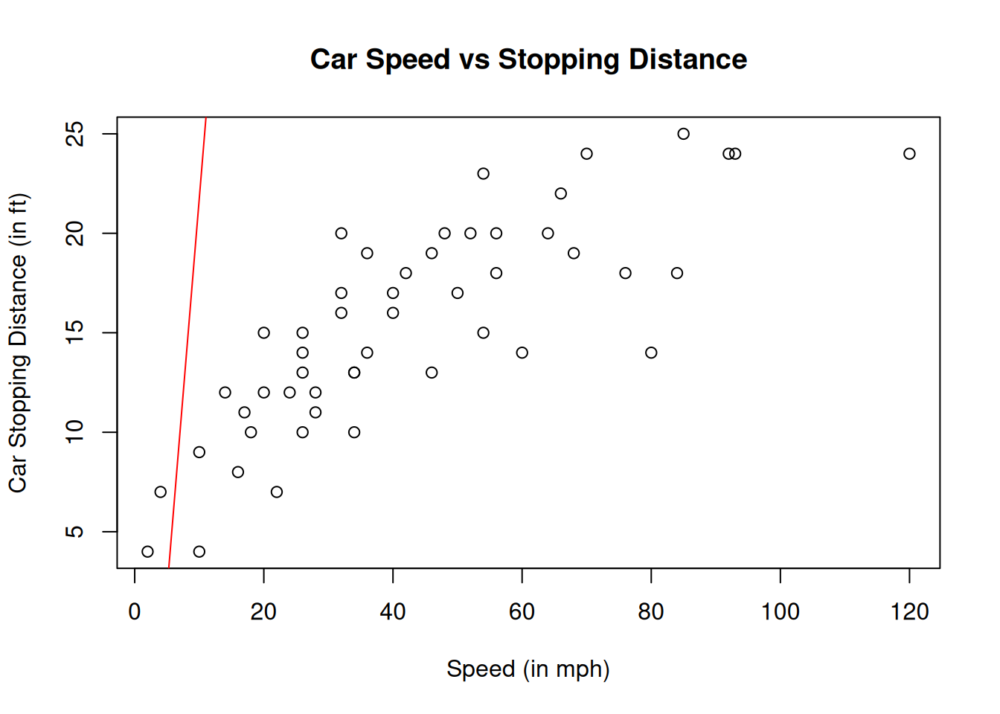
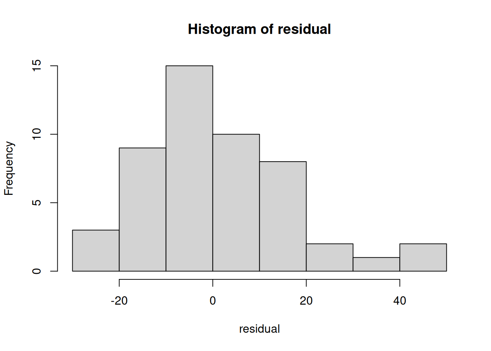
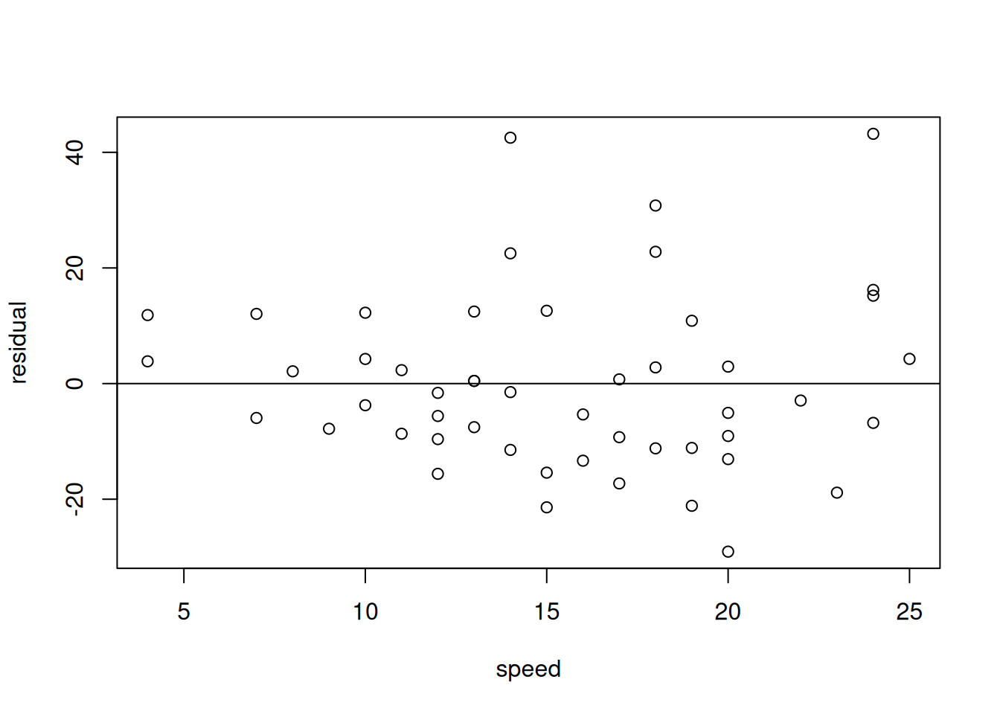
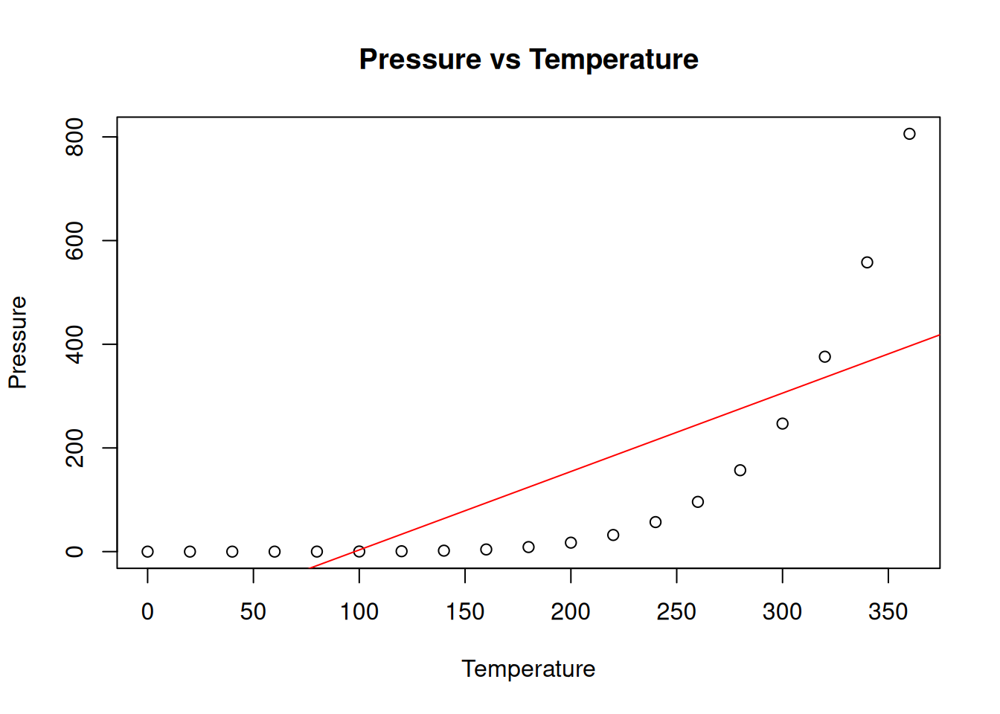
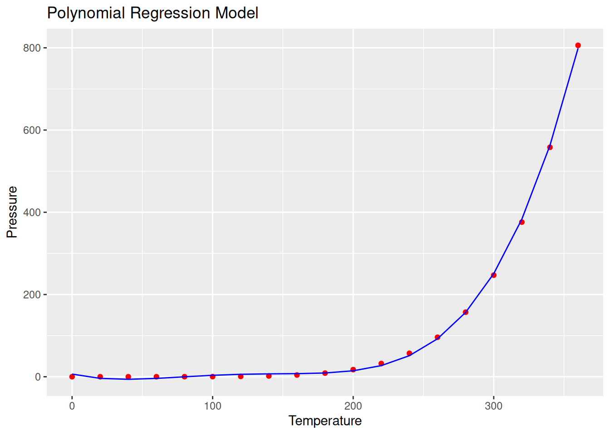

# Simple Linear Regression Model 

#### Bhuvan Kapoor 

``` r
# Experiment 2
# Simple linear regression model: fitting, estimation of parameters, computing R**2 and adjusted R**2 and model interpretation

cars
```

    ##    speed dist
    ## 1      4    2
    ## 2      4   10
    ## 3      7    4
    ## 4      7   22
    ## 5      8   16
    ## 6      9   10
    ## 7     10   18
    ## 8     10   26
    ## 9     10   34
    ## 10    11   17
    ## 11    11   28
    ## 12    12   14
    ## 13    12   20
    ## 14    12   24
    ## 15    12   28
    ## 16    13   26
    ## 17    13   34
    ## 18    13   34
    ## 19    13   46
    ## 20    14   26
    ## 21    14   36
    ## 22    14   60
    ## 23    14   80
    ## 24    15   20
    ## 25    15   26
    ## 26    15   54
    ## 27    16   32
    ## 28    16   40
    ## 29    17   32
    ## 30    17   40
    ## 31    17   50
    ## 32    18   42
    ## 33    18   56
    ## 34    18   76
    ## 35    18   84
    ## 36    19   36
    ## 37    19   46
    ## 38    19   68
    ## 39    20   32
    ## 40    20   48
    ## 41    20   52
    ## 42    20   56
    ## 43    20   64
    ## 44    22   66
    ## 45    23   54
    ## 46    24   70
    ## 47    24   92
    ## 48    24   93
    ## 49    24  120
    ## 50    25   85

``` r
summary(cars)
```

    ##      speed           dist       
    ##  Min.   : 4.0   Min.   :  2.00  
    ##  1st Qu.:12.0   1st Qu.: 26.00  
    ##  Median :15.0   Median : 36.00  
    ##  Mean   :15.4   Mean   : 42.98  
    ##  3rd Qu.:19.0   3rd Qu.: 56.00  
    ##  Max.   :25.0   Max.   :120.00

``` r
speed <- cars$speed
speed_bar <- mean(speed)

distance <- cars$dist
distance_bar <- mean(distance)

# b1 <- cov(speed,distance)/var(speed)
b1 <- sum((speed-speed_bar)*(distance-distance_bar))/sum((speed-speed_bar)**2)
b1
```

    ## [1] 3.932409

``` r
# b0 <- y_bar - b1*x_bar
b0 <- distance_bar - b1*speed_bar
b0
```

    ## [1] -17.57909

``` r
# Scatter Plot, estimation of regression coeff using inbuild function & adding a line of best fit
plot(speed~distance, xlab = "Speed (in mph)", ylab = "Car Stopping Distance (in ft)", main = "Car Speed vs Stopping Distance")

SLR <- lm(distance~speed)
SLR
```

    ## 
    ## Call:
    ## lm(formula = distance ~ speed)
    ## 
    ## Coefficients:
    ## (Intercept)        speed  
    ##     -17.579        3.932

``` r
abline(SLR, col="red")
```



``` r
# Error analysis
# We assume the errors are normally distributed and are independent with constant variance
residual <- SLR$residuals
hist(residual)
```



``` r
# the above histogram is bell-shaped and positively skewed 

# Homoscedasticity Assumption - variance is const
plot(residual~speed)
abline(0,0)   # for slower speed, there is a little variability, while for higher speed there is large variability
```



``` r
# R-sq and Goodness of Fit
summary(SLR)  # high r-sq value represents smaller difference between observed and fitted values
```

    ## 
    ## Call:
    ## lm(formula = distance ~ speed)
    ## 
    ## Residuals:
    ##     Min      1Q  Median      3Q     Max 
    ## -29.069  -9.525  -2.272   9.215  43.201 
    ## 
    ## Coefficients:
    ##             Estimate Std. Error t value Pr(>|t|)    
    ## (Intercept) -17.5791     6.7584  -2.601   0.0123 *  
    ## speed         3.9324     0.4155   9.464 1.49e-12 ***
    ## ---
    ## Signif. codes:  0 '***' 0.001 '**' 0.01 '*' 0.05 '.' 0.1 ' ' 1
    ## 
    ## Residual standard error: 15.38 on 48 degrees of freedom
    ## Multiple R-squared:  0.6511, Adjusted R-squared:  0.6438 
    ## F-statistic: 89.57 on 1 and 48 DF,  p-value: 1.49e-12

``` r
# Hypothesis Testing
# Ho: B1 = 0
# H1: B1 != 0

anova(SLR)
```

    ## Analysis of Variance Table
    ## 
    ## Response: distance
    ##           Df Sum Sq Mean Sq F value   Pr(>F)    
    ## speed      1  21186 21185.5  89.567 1.49e-12 ***
    ## Residuals 48  11354   236.5                     
    ## ---
    ## Signif. codes:  0 '***' 0.001 '**' 0.01 '*' 0.05 '.' 0.1 ' ' 1

``` r
# Using Table Values
Ft <- qf(0.95,1,48)
Ft    
```

    ## [1] 4.042652

``` r
# Ft < F_calculated(using anova), therefore reject Ho

# P-value
pv <- 1 - pf(89.567,1,48) 
pv  # our p-value < alpha (i.e. 0.05), we reject Ho
```

    ## [1] 1.489919e-12

``` r
# Confidence Interval
confint(SLR,level = 0.95)
```

    ##                  2.5 %    97.5 %
    ## (Intercept) -31.167850 -3.990340
    ## speed         3.096964  4.767853

``` r
# Prediction and Confidence intervals for stopping distance when the speed is 15mph
new_data <- data.frame(speed = 15)
new_data
```

    ##   speed
    ## 1    15

``` r
conf <- predict(SLR, new_data, interval = "confidence")
conf
```

    ##        fit      lwr      upr
    ## 1 41.40704 37.02115 45.79292

``` r
pred <- predict(SLR, new_data, interval = "predict")
pred
```

    ##        fit      lwr      upr
    ## 1 41.40704 10.17482 72.63925

``` r
#--------------------------------#
#           Exercise             #
#--------------------------------#
# Import the data set "pressure" that represents vapor pressure of mercury 4, as a function of temperature in to R and perform the following

pressure
```

    ##    temperature pressure
    ## 1            0   0.0002
    ## 2           20   0.0012
    ## 3           40   0.0060
    ## 4           60   0.0300
    ## 5           80   0.0900
    ## 6          100   0.2700
    ## 7          120   0.7500
    ## 8          140   1.8500
    ## 9          160   4.2000
    ## 10         180   8.8000
    ## 11         200  17.3000
    ## 12         220  32.1000
    ## 13         240  57.0000
    ## 14         260  96.0000
    ## 15         280 157.0000
    ## 16         300 247.0000
    ## 17         320 376.0000
    ## 18         340 558.0000
    ## 19         360 806.0000

``` r
temp <- pressure$temperature
pres <- pressure$pressure

# i) Obtain the summary statistics for the imported data set
summary(pressure)
```

    ##   temperature     pressure       
    ##  Min.   :  0   Min.   :  0.0002  
    ##  1st Qu.: 90   1st Qu.:  0.1800  
    ##  Median :180   Median :  8.8000  
    ##  Mean   :180   Mean   :124.3367  
    ##  3rd Qu.:270   3rd Qu.:126.5000  
    ##  Max.   :360   Max.   :806.0000

``` r
# ii) Estimate the regression coefficients by OLS method.

temp_bar <- mean(temp)
temp_bar
```

    ## [1] 180

``` r
pres_bar <- mean(pres)
pres_bar
```

    ## [1] 124.3367

``` r
b1 <- sum((temp-temp_bar)*(pres-pres_bar))/sum((temp-temp_bar)**2)
b1
```

    ## [1] 1.51242

``` r
# b0 <- y_bar - b1*x_bar
b0 <- pres_bar - b1*temp_bar
b0
```

    ## [1] -147.8989

``` r
# iii) Obtain the scatterplot and estimate the Regression Coefficients using inbuilt function.
plot(pres~temp, xlab = "Temperature", ylab = "Pressure", main = "Pressure vs Temperature")
SLR <- lm(pres~temp)
SLR
```

    ## 
    ## Call:
    ## lm(formula = pres ~ temp)
    ## 
    ## Coefficients:
    ## (Intercept)         temp  
    ##    -147.899        1.512

``` r
abline(SLR, col="red")

# modification to the model
pressure_data_new <- pressure
pressure_data_new$temp2 <- pressure_data_new$temperature**2
pressure_data_new$temp3 <- pressure_data_new$temperature**3
pressure_data_new$temp4 <- pressure_data_new$temperature**4
poly_reg <- lm(pressure~., data = pressure_data_new)

# Visualize
library(ggplot2)
```



``` r
ggplot() + geom_point(aes(pressure_data_new$temperature,pressure_data_new$pressure),col="red") + geom_line(aes(pressure_data_new$temperature,predict(poly_reg, newdata = pressure_data_new)),col="blue") + ggtitle("Polynomial Regression Model") + xlab("Temperature") + ylab("Pressure")
```



``` r
summary(poly_reg)
```

    ## 
    ## Call:
    ## lm(formula = pressure ~ ., data = pressure_data_new)
    ## 
    ## Residuals:
    ##     Min      1Q  Median      3Q     Max 
    ## -7.1989 -4.2112  0.2224  4.0172  7.0729 
    ## 
    ## Coefficients:
    ##               Estimate Std. Error t value Pr(>|t|)    
    ## (Intercept)  6.453e+00  4.645e+00   1.389 0.186418    
    ## temperature -7.992e-01  1.893e-01  -4.223 0.000852 ***
    ## temp2        1.588e-02  2.226e-03   7.135 5.06e-06 ***
    ## temp3       -1.052e-04  9.415e-06 -11.179 2.31e-08 ***
    ## temp4        2.341e-07  1.297e-08  18.056 4.28e-11 ***
    ## ---
    ## Signif. codes:  0 '***' 0.001 '**' 0.01 '*' 0.05 '.' 0.1 ' ' 1
    ## 
    ## Residual standard error: 5.38 on 14 degrees of freedom
    ## Multiple R-squared:  0.9996, Adjusted R-squared:  0.9994 
    ## F-statistic:  7841 on 4 and 14 DF,  p-value: < 2.2e-16

``` r
# iv) Perform test for significance of slope parameter by ANOVA
anova(SLR)
```

    ## Analysis of Variance Table
    ## 
    ## Response: pres
    ##           Df Sum Sq Mean Sq F value   Pr(>F)    
    ## temp       1 521530  521530   22.93 0.000171 ***
    ## Residuals 17 386665   22745                     
    ## ---
    ## Signif. codes:  0 '***' 0.001 '**' 0.01 '*' 0.05 '.' 0.1 ' ' 1

``` r
# v) Obtain confidence interval and prediction intervals when the temperature is 250.
new_data <- data.frame(temp = 250)
new_data
```

    ##   temp
    ## 1  250

``` r
conf <- predict(SLR, new_data, interval = "confidence")
conf
```

    ##        fit      lwr      upr
    ## 1 230.2061 143.5771 316.8351

``` r
pred <- predict(SLR, new_data, interval = "predict")
pred
```

    ##        fit      lwr      upr
    ## 1 230.2061 -99.5663 559.9785

